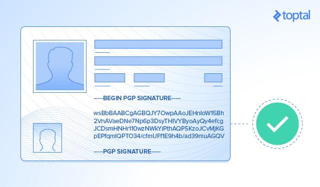

Whenever I tell my friends that I work remotely for a client I’ve never met, they ask me: is it secure for you to work remotely? My answer is a resounding “Yes… but, it depends on how well you create your remote worker security policy.”

I live in Pakistan where I produce code that is of value to clients on the other side of the planet. My clients have never shaken my hand, or seen where I work. And yet, I’m expected to ensure client secrets and code remain protected. In a world where your team members aren’t familiar with your face or your voice, how do you prevent security breaches? The answer is: **By being very careful.**

Not too long ago, we believed that to guarantee the performance and security of our applications, we needed to run them in our private datacenter. Then the _cloud_ came around, and we embraced the cost and performance benefits of running our applications on a scalable, on-demand platform without maintaining a fleet of servers in a room.

Allow me let you in on a well-known secret:

> There is no cloud.  
>  It’s just someone else’s computer.

Now, companies like Uber[1](https://eng.uber.com/tech-stack-part-one/)and Stripe[2](https://aws.amazon.com/solutions/case-studies/stripe/)store and process real-time customer location information and credit card and payments on a cloud provider’s server, while adhering to strict security standards like PCI-compliance. They do this by adopting strict policies that will ensure their production data will remain secure.

If companies can guarantee their entire production environment remains safe despite running outside their private data centers, we can certainly ensure the security of your development using remote development teams. After all, whole companies are capable of running entirely remotely. Toptal is a remote-only company, and [we’re hiring](https://www.toptal.com/careers).

### What Is “Security” and How Do I “Be Secure”

Throughout this article, when I talk about “security” I mean **information security**.

> _“The term ‘information security’ means protecting information and information systems from unauthorized access, use, disclosure, disruption, modification, or destruction.” — 44 U.S. Code § 3542_

There is _no such thing as perfect security_, but “being secure” means you’ve taken _reasonable measures_ to enforce information security.

Specifically, when you say “my work environment is secure,” you mean to say that you’ve taken reasonable measures to protect the data, code, or other confidential information in your care, and ensured its integrity. You’ve also taken steps to make sure that your privileges to access sensitive information systems will not be used by yourself, or an unauthorized individual, in a manner that is detrimental to the goals of the organization that owns this information, and these systems.

Remote teams do have a far larger attack surface than centralized teams. Unlike a centralized team where you can physically lock down confidential information behind firewalls and company workstations, as a remote worker, you are encouraged or even required, to bring your own device (BYOD). What’s more, since most of your communications happen online, you’re far more susceptible to social engineering and [identity theft](https://www.toptal.com/freelance/freelancer-identity-theft). However, with the right set of policies in place, you can certainly minimize the risk of a breach.

There is no silver bullet for security. Often, there’s a tradeoff between shades of security and convenience, and it’s up to you to determine how far you want to take your security practices but remember, your team is only as secure as its weakest member. Let’s take a look at some common security attacks, defense strategies, and finally discuss a sample remote security worker policy.

### The Three Most Common Types of Adversarial Attacks

You aren’t prepared if you don’t know what it is you’re going to face. An adversary can use many strategies in their attack, but most fall into three categories. While this list isn’t exhaustive, these are three common types of attack vectors malicious hackers may use:

-   Social Engineering
-   Phishing
-   Malware Infections

### Social Engineering

Also considered human hacking, social engineering is the practice of manipulating people to act in a manner that is not in their best interest; this may include divulging confidential information.

Social engineering attacks can either try to exploit your compassion in an attempt to make you circumvent good practices, or create a sense of urgency where they make you bypass best practices by fearing a negative action against you if you don’t comply.

Examples of social engineering include:

### Phishing

Phishing is the most common method to steal your credentials. Imagine a website that looks just like Facebook, where you log in, thinking it’s the real thing. Phishing is when an attacker creates a website that looks legitimate but isn’t.

Can you spot the fake facebook? Hint: It’s the one not on Facebook.com.

Sometimes hackers can poison your internet and inject their website on the Facebook domain, this is called a Man in The Middle attack, but don’t worry, your browser can warn you about these.

Spear phishing is another form of phishing where the phishing page may be custom made for you or your organization. This makes it more likely for you to fall for it, especially when combined with social engineering.

I’ll tell you a story: When I was in school, someone who had recently learned about phishing created a fake Facebook website and changed the homepages in the computer lab to his creation. Next thing he knew, this person had three hundred Facebook account passwords. This attack was specifically targeted at my school and turned out to be a successful spear phishing attack.

And to think that all those passwords would have remained safe if only someone had bothered to look up at the address bar.

### Malware Infection

There are hundreds of different types of malware out there. Some are harmless or just annoying, but some can be very dangerous. The most important types of malware to look out for are:

-   Spyware: Silently installs and records your keystrokes, screen, audio and video.
-   Remote Administration Tools (RATs): Allow complete control over your computer.
-   Ransomware: Encrypts all your important files and makes you pay for the decryption key.

To intentionally get you to install custom malware on your computer, attackers usually use social engineering:

-   Attacker [plants “lost” USB drives](http://boingboing.net/2012/07/10/dropped-infected-usb-in-the-co.html) around company parking lot to harvest employee login credentials.
-   A man who spilled coffee on his resume asks the receptionist to print him a copy of something because he has an interview, thus causing a company computer to be infected by a malicious payload in a USB. (Example from [The Art of Human Hacking](https://www.amazon.com/Social-Engineering-Art-Human-Hacking/dp/0470639539)).

### Seven Cyber Defense Strategies You Need Right Now

We’ve discussed the most common adversarial attack methods, but how do we stay safe from them?

### Strategy №1: Proper Password Management

I hate passwords. There, I said it. I firmly believe that the username and password combination is the weakest form of user authentication in existence. A password is nothing more than a short string of characters generated by the worst pseudorandom number generator in existence: the human mind.

> _“I need a secret word, eh? How about my middle name and year of birth, surely no one will be able to guess that!” — Every Human Ever_

What’s worse is that for convenience’s sake, people tend to reuse passwords. That makes it possible for someone to use the same password for their bank login and their home WiFi, _while making it likely that the password ends with the name of their favorite band_. The horror!

Years ago I resolved to do the following:

1.  Use a password manager
2.  Use strong passphrases instead of passwords

#### Use a Password Manager

When I said there’s a tradeoff between shades of security and convenience, it does not apply here. Either you’re secure and using a password manager, or you are not. There is no in-between. It is mandatory for you to be using a password manager for good password security. I’ll explain.

1.  Are all your passwords unique?
2.  If I discovered some of your passwords, will the rest of your passwords stay secure?
3.  Were all your passwords created using at least 32 bits of entropy?
4.  Are your passwords stored only in encrypted form?
5.  Do you perfectly remember every single password you’ve used when signing up?
6.  Do you turn up positive for a password leak at [this website](https://haveibeenpwned.com/)?

If you answered “no” to any of the questions above, you need a password manager. A good password manager will randomly generate your passwords for you, and store them safely. It doesn’t matter what password manager you use, as long as you use one!

I use [LastPass](https://lastpass.com/f?3909636) because I like how transparent they are with their incident reports, the ability to share my credentials with friends and revoke the share whenever I want, and I like the fact that mobile sync is part of their free plan.

I’ve been using LastPass for years, and their security challenge tells me I’m in their top 1% of security conscious users.

#### Strong Passphrases Instead of Passwords

**tl;dr:** Use [this](https://iancoleman.github.io/bip39/) to generate a passphrase. 12 words should be enough.

This may sound counter-intuitive since I asked you to use a password manager above, but there are cases where passwords are unavoidable: you will need a strong master password for your password manager, or to log into your computer. In these cases, use a secure and memorable passphrase with high entropy.

Speaking of entropy, let’s talk a bit about it. What is this “entropy” I speak of?

> _“The entropy is a statistical parameter which measures in a certain sense, how much information is produced on the average for each letter of a text in the language. If the language is translated into binary digits (0 or 1) in the most efficient way, the entropy H is the average number of binary digits required per letter of the original language.” — Claude Shannon_

It’s alright if that quote was hard to digest. Basically, the entropy for a password, randomly selected from a set, is the total number of elements in the set expressed in base 2. For example: If you have a password 4 characters long, that can only contain lowercase alphabet, the entropy for a randomly generated password would be 19 bits because:

1.  There are 26 elements in a lowercase alphabet
2.  A 4 character string composed of those letters is `26^4` = 456,976
3.  456,976 expressed in base 2 is `log(456,976) / log(2)` = 19 bits (rounded to the nearest bit)

The problem with high entropy passwords is that they end up being difficult to remember, like `c05f$KVB#*6y`. To make them more memorable, what if instead of using single letters, we used whole words instead? And used a dictionary of a thousand words? Suddenly our alphabet becomes a thousand elements long, and we can achieve the same entropy in 7 words that we would have with 11 characters.

The difference now is that instead of using a pass**word**, we’re using a pass**phrase**, which is much longer in length.

The following XKCD comic best explains this concept:

The easiest way to generate a secure random passphrase is by going [here](https://iancoleman.github.io/bip39/).

### Strategy №2: Use Multifactor Authentication (MFA)

Two-factor Authentication (2FA) or 2-step verification are all names for the same thing. This is one of those things that requires getting a little used to, but the security benefits of 2FA far exceed the costs and have personally saved me from account breaches twice!

The idea behind MFA is simple. There are three things we can use to authenticate you:

1.  Something you know (a secret)
2.  Something you have (a token)
3.  Something you are (your biology)

Using two is more secure than only using one.

Most websites support the first factor of authentication by requiring a password, but an increasing number of services have started supporting the second factor as well. The third factor is usually left out by web services since it requires specialized hardware; like the fingerprint sensor on your phone.

If you’re an administrator for a team, consider creating a mandatory policy for users to have 2FA setup. This ensures that a password compromise will not result in an account compromise.

There are two popular forms of “something you have”:

#### Using your phone for 2FA

I’d like to say this right off the bat: don’t use SMS codes for 2FA. It’s becoming common practice for malicious people to hijack your phone number. The [story](https://blog.coinbase.com/on-phone-numbers-and-identity-423db8577e58) is almost always the same: Someone social engineered a carrier into porting away your phone number to another carrier. I know at least one person who has fallen victim to this attack.

Instead, use time-based one-time passwords (TOTP) also called the “Google Authenticator” method. However, instead of using Google Authenticator, I recommend using [Authy](https://www.authy.com/) since it encrypts and backs up your 2FA tokens on the cloud. You can then restore your 2FA tokens even if you change devices… in fact, you can use the same tokens on multiple devices. It’s very convenient.

#### Using a U2F key For 2FA

This is the simplest and most powerful 2FA method. I have a Yubikey Neo that I can use with my phone and my computer. To prove my identity, I just plug in my hardware token and press a button. My token is unique and being a physical token; I can carry it on my keychain or in my wallet.

### Strategy №3: Constant Vigilance

Regardless of how secure you believe you are, a healthy amount of suspicion is a good thing. Be wary of people asking you to do anything out of the ordinary. Did you receive a text message from someone asking you to reset their password? Wait a minute, and jump on a video call with them. Ask them to prove their identity. No one can fault you for being cautious.

> _“It’s not paranoia if they’re really out to get you.” — Harold Finch, Person of Interest_

They really are out to get you. Sometimes there’s no reason for a malicious user to do what they do, apart from the will to do it.

A friend of mine once received a message from an old acquaintance asking if they would like to be their “trusted contact” on Facebook. My friend agreed and was asked to reply with a code they would receive on their phone, which my friend promptly gave… and that was how my friend was social-engineered into giving the reset token for her Gmail account. If my friend had been vigilant from the beginning, she would never have lost her emails.

### Strategy №4: Design Systems According to the Principle of Least Privilege

> _“The principle of least privilege requires that in a particular abstraction layer of a computing environment, every module (such as a process, a user, or a program, depending on the subject) must be able to access only the information and resources that are necessary for its legitimate purpose.” — Wikipedia_

If a user, application, or service doesn’t require certain privileges, don’t give it to them. You can derive many rules from this principle, but I’ll save them for the next section on security policies.

Let me tell you a story: I was once designing an application that would accept Bitcoin payments from users on addresses generated uniquely for them and then forward them on to a central secure storage address. If you’re not familiar with how Bitcoin works, here’s a simplified explanation: You need a public key to receive Bitcoin (like an account number) and a corresponding private key to spend it (like an account pin). The account numbers and pins in Bitcoin are cryptographically linked and cannot be changed.

I had several options to design this system, but I decided to take slightly longer route. I decided that for prompting the user to pay, the application did not need access to the private keys. So, instead of designing one large system that would receive and forward Bitcoin payments, I made two systems:

1.  The receiving system: This received Bitcoin from users and was hosted on the public internet. It contained only the public keys for the addresses.
2.  A forwarding system: This was a completely independent and locked down system whose sole job was to watch the Bitcoin network for transactions on the addresses and forward them on to the secure address. It contained both public and private keys for the addresses.

A long time later, after I stopped maintaining the app, the public receiving system was breached. I promptly shut it down, but the attacker never managed to steal the Bitcoin because the public system didn’t contain any private keys at all.

### Strategy №5: Use Common Sense Best Practices

Some practices need no explanation. You probably know them to be important, but I’m constantly surprised by how many people (including myself) forget to flip a few switches. I’ll leave this checklist here:

1.  Turn on your firewall
2.  Encrypt your disk
3.  Enable encrypted backups
4.  Use SSH keys
5.  Use a secure internet connection

#### Turn on your firewall

A firewall controls network traffic to and from your computer based on a set of rules. It works by explicitly asking you whether to allow new programs to access your network and is your first line of defense.

Your operating system likely comes with a firewall built in. Ensure that it is turned on.

#### Encrypt your disk

Full disk encryption is this magical ability to render your entire disk’s content useless without your password. In the event your laptop is lost or stolen, you can rest assured that no one will be able to access your data. Enabling this can be as simple as turning on [FileVault](https://support.apple.com/en-us/HT204837) on a Mac.

Modern cellular phones also have full disk encryption enabled by default.

#### Encrypt your backups

Hardware fails, it’s a fact of life. Your machine will fail one day, or a virus will infect your PC, or (shudder) a ransomware virus will take over your PC. But as a pragmatic person, you’ve probably already got a backup flow setup, I’m sure… haven’t you?

However, even with your backups, you must remain vigilant. Ensure your backups are encrypted so that even if they’re lost or stolen, you can rest assured that you took reasonable measures to protect the safety of the data you were entrusted with.

If you have a Mac, the Time Machine app on your Mac automatically encrypts backups.

#### Use SSH keys

If you take anything away from this article, stop using passwords to SSH into machines. Passwords are difficult to share, and if they ever get leaked your entire machine gets compromised. Instead, create an SSH key simply by running `ssh-keygen`.

To log into a remote machine, simply copy the contents of your local `~/.ssh/id_rsa.pub` to `~/.ssh/authorized_keys` in the remote machine. You may need to restart the SSH service on the remote machine, but that’s it.

Add your entire team’s SSH keys to the remote machine and no one will ever have to type a password again. Revoking a team member’s key is as simple as removing the key from the remote machine.

#### Use a secure internet connection

When you share an internet connection with someone, you share more than your bandwidth. Depending on the configuration of the websites and your internet, they can at least detect what websites you visit, and at worst read all the information you transmit, including passwords, messages, or emails.

This is very simple to enable and extremely easy to mess up as well. Take reasonable precautions to ensure your connection is private. Make sure no one unauthorized has access to your internet connection.

Use WPA2 to password protect your own personal WiFi, and if you’re working from the local coffee shop (or any public WiFi) assume you’re being watched and use a VPN proxy.

I hesitate to use subscription based VPNs, especially since rolling your own is so simple. Use this [one-line VPN solution](https://github.com/Nyr/openvpn-install) to host your own.

### Strategy №6: Treat Secrets with Care

Secrets aren’t meant to be disclosed. That’s why they’re called _secrets_. Despite that, how many times have you been guilty of sending the password to the production PostgreSQL database via Facebook Messenger? Ensure that you always:

-   Encrypt secrets in transit
-   Rotate them often

#### Encrypt secrets in transit

If you must share secrets via channels such as chat, ensure they are encrypted. As an exercise, visit your frequently used and oldest chat client. It may be Facebook messages or Whatsapp. Regardless of what it is, open and search for the phrase “password” in your messages.

If these secrets had been encrypted, they would not be available to anyone with access to your messages.

#### Rotate secrets often

The longer a secret exists or the more it has been shared, the more likely it has been compromised. It is considered a good practice to rotate secrets and passwords after a certain period of time.

### Strategy №7: Establish Cryptographic Identities

This is certainly an advanced strategy, but I personally don’t understand why this isn’t a widespread practice. Consider this: Your coworker believes you’ve been compromised. How do they get a message across to the real you? If someone from the internet has to share important vulnerability information, how do they send it securely? How do you ensure your employees securely share information in transit?

My favorite example of this is Coinbase’s [keybase profile](https://keybase.io/coinbase), where they cryptographically sign the PGP keys of their employees. They’ve gone further and given their [compliance department a PGP key](https://keybase.io/cbcompliance). Seriously, Coinbase, great work!

For me, personally, in the event that someone has a reasonable doubt that my online identity has been compromised, simply ask me to sign a message using the PGP key available on my [keybase](https://keybase.io/gilani) profile. I’m the only person with access to this PGP key, and I’ve taken reasonable precautions to ensure this key remains safe even if my other identities are compromised.

If in doubt about the authenticity of a message, ask me to sign it. If you need to send me a secret, encrypt it with my public key.

> _“Security policy is a definition of what it means to be secure for a system, organization or other entity. For an organization, it addresses the constraints on behavior of its members as well as constraints imposed on adversaries by mechanisms such as doors, locks, keys and walls.” —_ [_Wikipedia_](https://en.wikipedia.org/wiki/Security_policy)

A security policy is a mandatory rule or protocol that must be followed when performing actions. The strategies above are helpful but to make them easier to follow, give your team a straightforward set of rules to follow. It’s harder to mess up security when your team knows exactly what to do.

Let’s discuss examples of a remote worker security policy to implement.

Policies to implement for your **employees**:

-   _NDAs and contracts:_ Ensure that no employee has access to any confidential resources without appropriate legal groundwork.
-   _Emergency contact information:_ Take down your employee’s full and emergency contact information in the event your remote team member becomes unresponsive.
-   _Grant essential privileges only:_ If your team member does not need access to certain areas to perform their function, don’t grant them access. A member of the sales team does not need access to your code repository.
-   _Password managers:_ Ensure your employees have access to a password manager
-   Strong authentication policies
-   _Minimal password strength:_ I personally hate passwords and, for organizations where I’m an administrator, I require passwords with a minimum of fifty alphanumeric characters. It’s trivial to adhere to this policy if you’re using a password manager.
-   _Mandatory password resets:_ Ensure that your employees’ passwords expire frequently to rotate secrets often.
-   _Two-factor authentication_: Use 2FA everywhere
-   PGP keys
-   Encrypted hard disks
-   Encrypted backups

Employees leave, but they shouldn’t take your information along with them. Adapt these policies to retain **data** even after your employees leave the company:

-   _Corporate email accounts:_ Giving your employees email accounts on your own domain allows you to disable and audit their communications.
-   _Real-time communications:_ Even though email is great, sometimes your team needs to talk in real time. Ensure that your team has a centralized Slack or IRC channel. This gives you the ability to disable or audit their communications as required.
-   _Centralized code repositores:_ Make sure all company code is stored in a company code repository. Company plans on public SaaS offerings like GitHub are fine until you need fine-grained control over all employee code. In the latter case, consider getting your own GitLab instance.

Policies to protect your **infrastructure**:

-   _Keep Systems Updated:_ Security vulnerabilities are discovered and patched every day, it is your job to ensure your apply these fixes. There’s nothing worse than to discover that a breach was caused by vulnerability that was patched weeks ago.
-   _Lock down production and staging environments:_ No employee should have access to production or staging environments. Sometimes they just [mess](https://about.gitlab.com/2017/02/10/postmortem-of-database-outage-of-january-31/) [up](https://www.theguardian.com/technology/2017/mar/03/typo-blamed-amazon-web-services-internet-outage).
-   _Create a strong CI/CD flow:_ You always want to deploy “good” code, and straightforward CI/CD process always ensures this.
-   _Protect the blessed repository:_ If you have an automated CI/CD process, ensure your blessed repository is only editable by the project manager.
-   _Define a review process:_ To ensure no “bad” code makes it through unnoticed, create a review process. This can be as simple as requiring at last one independent “Looks good to me” (LGTM) comment before merging.
-   _SSH Keys:_ In the off chance your application requires giving SSH access, make sure they use SSH keys instead of passwords.
-   _Consider dropping BYOD:_ The budget team might think that BYOD is the best policy innovation since the paper-free office, but if you can afford it, consider supplying your team with corporate machines that you can implement rigorous security policies on.
-   _Encrypted Backups:_ Your data is important.

Policies when writing **code**:

-   _No secrets in code:_ Due to the nature of version control, it can be very difficult to remove data when added in code, where [secret keys are very easy to find](http://thehackernews.com/2013/01/hundreds-of-ssh-private-keys-exposed.html).
-   _Bcrypt when storing passwords:_ When designing an authentication system, use [bcrypt](https://en.wikipedia.org/wiki/Bcrypt) to hash and salt your passwords instead of designing your system, or (gulp) storing in plain text.
-   _Filter sensitive information from logs:_ Whether it’s your global pepper, your application’s session signing key, or a user’s login attempt, ensure that these aren’t leaked into your system log files where anyone with access can read them.
-   _Grant the least privileges required:_ If your application only needs `READ` privileges, don’t grant it `WRITE` privileges. Adhere to the principle of least privilege.

### Create a Response Plan

Security breaches do happen on occasion, and while there will be plenty of time for learning during a post-mortem, what matters is that there is a clear path to secure all digital assets.

Take the time to work out a contingency plan in the event a security breach does happen. Consider your actions in the following scenarios:

-   You lose a device with sensitive data.
-   Your infrastructure may have been accessed by an unauthorized party.
-   You observe someone on your team behaving strangely unlike themself.
-   A security vulnerability is discovered.

Things to include in your response plan:

-   _Diligent documentation:_ Enable screen recording, set up a wiki for your team to share everything they come across.
-   _Breach containment:_ Depending on the scope of the breach, this may be as simple as disabling a user account, taking a server offline, or shutting down production and contacting your users.
-   _Establish internal communication:_ Start a dedicated Slack channel, or find a way for anyone to report what they come across.
-   _Bringing in help:_ Call all the teams affected by the breach. This may be a good time to contact the authorities as well.
-   _Investigate:_ Figure out what was breached, to what extent, and what we can do to resume normal operations.
-   _Getting back online:_ Create, test, and publish a fix to resume normal operations as soon as possible. Your users depend on your service to work, and the moment you can guarantee stable, and secure service, get back online.
-   _Talk to your users:_ Don’t leave your users in the dark. The worst thing you can do is halt your service without explaining what’s going on to your users. Establish a live update channel; this may be as simple as using Twitter to keep them informed. After the incident has been handled, publish a post-mortem report talking about what happened, how it happened, and what you’ve done to prevent similar breaches in the future.

Security incidents happen. What matters is how you handle your response. One of my favorite responses by far was in 2015 when LastPass issued mandatory master password resets when they detected [anomalous network activity](https://blog.lastpass.com/2015/06/lastpass-security-notice.html/). I’ve been a long-time user of LastPass and, despite their [recent](https://blog.lastpass.com/2017/03/security-update-for-the-lastpass-extension.html/) security issues, I love the way they respond to their customers by placing their needs first.

### Recommended Reading

To reiterate: There is no such thing as perfect security. All that matters is that you ensure you’ve made a reasonable effort keep your data safe.

These security practices should make you and your remote team significantly harder to hack.

If you want to read a true story of a fugitive hacker on the run from the law, I recommend _Ghost in the Wires_ by Kevin Mitnick.

If you want to learn more about how the other side thinks, I recommend reading:

-   _Social Engineering: The Art of Human Hacking_ by Christopher Hadnagy
-   _The Art of Deception_ by Kevin Mitnick and William L. Simon

My crime is that of curiosity.

---

_Originally published at_ [_www.toptal.com_](https://www.toptal.com/remote/best-security-practices-for-remote-teams#contract-just-respected-software-architects)_._
