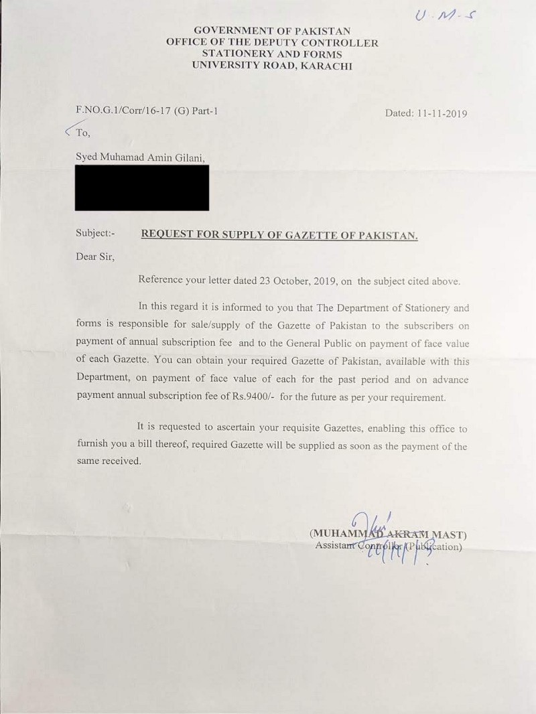
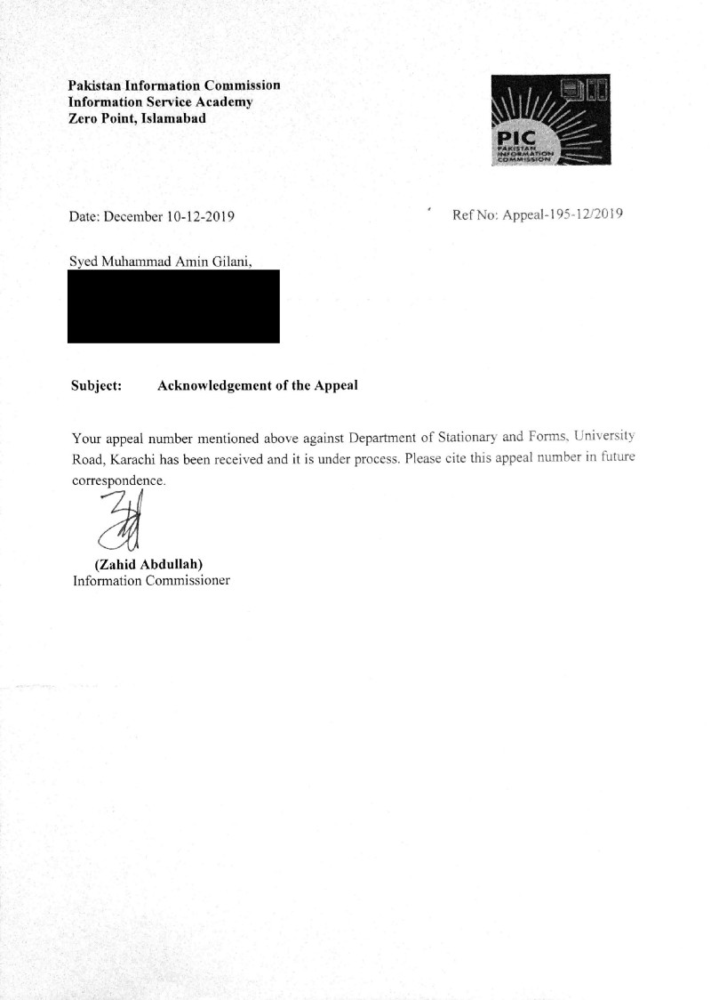
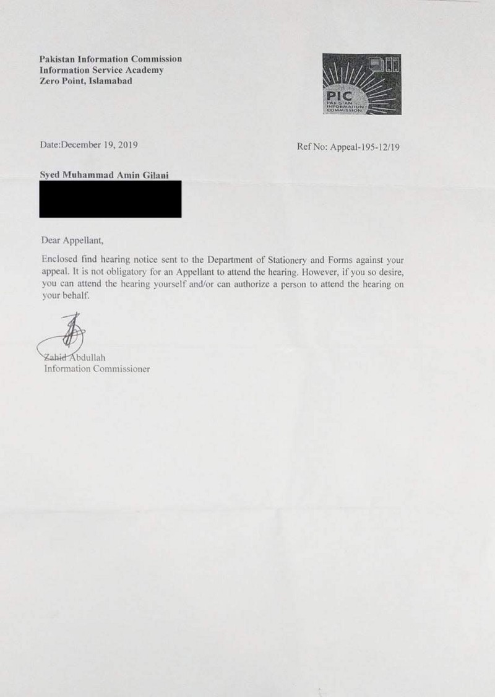
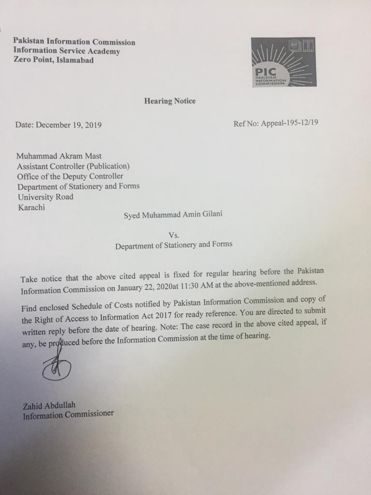

I decided to file a Right of Information request in Pakistan to a federal body. If you’re looking to file a request with an organization under the Punjab Government, please see [How to File a Right to Information Request in Punjab, Pakistan](https://medium.com/@gilani/how-to-file-a-right-to-information-request-in-punjab-pakistan-7df0d5ab5bd3). This particular request was sent to the Department of Stationary and Forms, an attached department of the [Cabinet Division,](http://www.cabinet.gov.pk/) for all copies of the Gazette of Pakistan. They replied back quoting prices above and beyond the prices allowed for information requests, and so I filed an appeal with the Information Commission that ruled in my favor.

Right of information law gives citizens the ability inspect public information. It’s a right every citizen of Pakistan has by virtue of the Constitution of Pakistan. This right is so fundamental, that it’s literally under _Chapter 1: Fundamental Rights_. The law that elaborates on this right and outlines the procedure to follow is the [Right of Access to Information Act, 2017](http://www.senate.gov.pk/uploads/documents/1510051317_684.pdf) (ROATIA). Following the same law, the [Federal Information Commission](https://rti.gov.pk) was formed, which exercised powers conferred on it from within the same law, and [regulations](http://rti.gov.pk/legal-framework/) which include a schedule of costs.

The Gazette of Pakistan, is best described by its (now defunct) [official webpage](https://web.archive.org/web/20090823002730/http://www.pakistan.gov.pk/gazpak.jsp):

> The Gazette of Pakistan is the official newspaper of the Government of Pakistan. The Gazette provides information about government acts, ordinances, regulations, orders, S.R.Os, notifications, appointments, promotions, leaves, awards, etc.

The Gazette notifies us, the general public, about laws, regulations, and anything else that the Government must notify. It surely makes sense that all this information must be published on the internet, but until my appeal, it was not.

#### Request Specifics

-   **Information required:** “all published copies of the Gazette of Pakistan”
-   **Information body:** Department of Stationary and Forms
-   **Request result:** Failed. Costs quoted were above and beyond the notified schedule of costs for federal information requests. Appeal filed.
-   **Appeal result:** Success. Information Commission ordered that information be furnished, and published online.
-   **Order compliance:** _Ongoing_

#### **Timeline:**

-   **October 23, 2019:** I sent my request for information, which is delivered the next day.
-   **November 11, 2019:** I receive a letter in which my request is met with a notice listing fees. These fees are above and beyond the fees prescribed in the Schedule of Costs for right of information requests.
-   **December 3, 2019:** I send my appeal to the Federal Information Commission
-   **December 10, 2019:** The Federal Information Commission sends me a letter acknowledging my appeal, it is delivered on December 19, 2019.
-   **December 19, 2019:** The Federal Information Commission issues a hearing notice to the Department of Stationary and Forms for January 22, 2020, and demands a written reply before the hearing. A copy of this notice is also sent to me and delivered on December 24, 2019.
-   **January 22, 2020:** The Department of Stationary and Forms does not attend the hearing, nor do they submit their written reply by the date.
-   **February 25, 2020:** The Information Commission issues its order, requiring the Department of Stationary and Forms to honor my request within 10 days. It also orders the Department to publish the information online and submit a report showing compliance by 24 March, 2020.
-   _The rest is still on-going…_

#### My Request

By virtue of the section 11(5) of the ROATIA, I did not have to provide a reason for my request, so I did not do so here. However, my reasons are not difficult to ascertain. I believe all public information should be public, and at the very least, people should have free and unfettered access to the laws and regulations that govern them.

This is the original request I filed:

Redacted original request filed to the department of stationary and forms

#### Response

Following my letter, I received this response where I was cited prices for the Gazette of Pakistan that the Department of Stationary and Form traditionally charges. These prices are beyond the amounts listed in the schedule of costs notified by the Federal Information Commission, and therefore invalid. The letter was also sent to me beyond the expiration of the 10-working-days deadline specified by the ROATIA. It is worth noting here that I do not believe that the sender here personally wanted to defy the ROATIA. That said, it is the duty of every public organization, just as it is of every citizen, to follow the law.

At this point, after having waited longer than the ROATIA asked me to, and having been met with a blatant violation of the schedule of costs, I recognized that the situation was beyond salvage by my own hand, and I required help. I had no choice but to appeal to the Information Commission.

#### Appeal to the Information Commission

Since I had no template to understand how the Commission preferred its appeals, I customized another appeal that my legal counsel once wrote for another federal RTI case that we filed in the Lahore High Court. That case is unrelated to this once and still in the courts, however, because of this templates roots in the courts, it looks like a high court petition. Yours does not need to. I took my time ensuring I documented everything that occurred during this request. I attached every piece of evidence I had, and listed every ROATIA violation that had occurred. This appeal is exhaustive in that it (hopefully) left nothing to chance. I’m a thorough person. This is why it took me so much longer to send the appeal.

Redacted appeal sent to the Information Commission

#### Notifications by the Information Commission

The Information Commission sent me two notifications:

1.  An acknowledgement
2.  A copy of the hearing notice sent to the Department of Stationary and Forms (2 pages)

Here they are:

1.  **Acknowledgement**

2\. Copy of hearing notice:

  

  

#### Final order by the Information Commission
