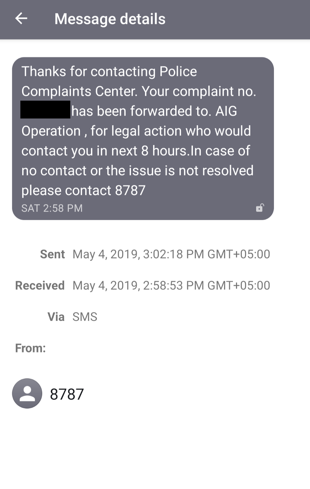

I decided to file a Right to Information request to the Punjab Police, this is what happened. This is on-going and the post will continuously be updated as new events occur.

**Timeline:**

-   April 1, 2019: I decide to file my request and start drafting a series of questions
-   April 18–25, 2019: I send my request
-   April 30, 2019: My request is delivered. Punjab Police now has 14 business days to respond to my request.
-   May 2, 2019: I receive my Acknowledgement Due card
-   May 4, 2019: I received an acknowledgment from the Punjab Police that my “complaint” was being processed
-   May 29, 2019: I mail a complaint to the Inspector General of Police about the non-compliance of the Public Information Officer, requesting an internal review
-   _the rest is ongoing_…

_For details, please see the Events section_

### Right to Information in Punjab, Pakistan

I’ve decided to file a Right to Information (RTI) request under Punjab’s provincial legal framework. The Right to Information laws let any citizen ask any semi- or fully-government organization for information on a particular matter. These requests are governed by:

1.  [Article 19A](http://www.pakistani.org/pakistan/constitution/part2.ch1.html) of the Constitution of Pakistan
2.  [Punjab Transparency and Right to Information Act 2013](http://punjablaws.gov.pk/laws/2547.html): An Act of the Punjab Assembly
3.  [The Punjab Transparency and Right to Information Rules 2014](https://rti.punjab.gov.pk/system/files/The%20Punjab%20Transparency%20and%20Right%20to%20Information%20Rules%20%20%202014_0.pdf): A set of Rules made in an exercise of powers granted to the Government by the Act in 2.

For ease-of-understanding, I’ve illustrated a simplified version of the RTI request process here, in a flowchart:

By law, I should receive answers to my questions within 14 working days. If not, I have can complain to the [Punjab Information Commission](https://rti.punjab.gov.pk/). I recommend visiting their website to learn more about the Punjab RTI process, the organizations that fall under this law, news, and more.

There exist separate provincial laws governing RTI for government organizations in other provinces, and a set of laws for federal organizations, as well. I’ve exercised my powers to request information from federal organizations in 2017, but that was during the time that the laws had been enacted but not yet implemented, and I faced problems I’m sure all federal RTI pioneers faced: non-compliance. For information on that matter, see [_LHC Set To Hear Citizen’s Appeal To Constitute Federal Information Commission On Thursday_](https://medium.com/@gilani/lhc-set-to-hear-citizens-appeal-to-constitute-federal-information-commission-on-thursday-e332f2172ef9)_._ That RTI was followed by non-compliance, and two petitions to the Lahore High Court, the second of which is still awaiting a hearing. Anyways, back to the current provincial RTI.

### The Request

My request itself is 5 simple questions asking for justifications, policy, and data around _Naka Bandi_ and “snap checks”.

The original request

By law, I am not required to provide any justification for my request to the organization, and so I did not. Nor in the request, or will I do so here in a public post. You shouldn’t either.

> **10\. Application procedure.–**   
> …  
> (3) An applicant shall not be required to provide reasons for request for information and shall only be required to provide an adequate description of the information and the details necessary to provide the requisite information.  
>  — Punjab Transparency and Right to Information Act 2013

If someone ever asks you why you require the data, **be polite** and tell them that you’re not required to answer that question.

### Events

Here are the events in more details

#### Sending the Request

When you’re ready to send your request:

-   Go to your nearest Pakistan Post office
-   With your document sealed, addressed and ready to send.
-   Specify that you want _registered mail_ that you can _track on their website_.
-   Ask for an Acknowledgement Due card. It‘s a piece of paper the recipient signs, and it is then mailed to your address. **Ensure that all the fields are filled out properly on the back and the front.** Especially the registration number — the postal worker will not fill it out unless you explicitly tell them to do so. Take a picture of the envelope with stamps attached.
-   Keep the receipt for the registered mail article safe. Take pictures just in case.

I sent the request using registered mail through Pakistan Post. It’s usually very reliable and definitely far cheaper than its competitors. I mostly recommend them for almost all types of mail, however, this time they messed up and didn’t update the tracking information reliably. More details below.

At first I sent a regular registered mail, but the tracking information stopped at the last post office which was supposed to deliver the mail.

I called the post office, and the woman said she hadn’t experienced registered mail ever showing last delivery information in her career, and suggested I call the last office to check if they’d delivered the mail. I did not ask how short her career was, nor did I not want to get caught up in bureaucratic whack-a-mole by calling 50 departments trying to find my mail — so I filed a complaint for lost mail. Now, because I had no proof of delivery, I resent a duplicate request, explaining how the post office had lost my mail, but this time I attached an Acknowledgement Due card.

An Acknowledgement Due card is dated, and signed by the recipient on delivery, and mailed back to you. It is proof that the letter was delivered and received at the destination. I’m glad I did this because the tracking information stopped being updated again.

You’ll receive a piece of paper that serves as a receipt as well a confirmation of sending. **Keep this original piece of paper safe**. This the only proof you have of mailing the request.

Obviously you’ll only have one receipt, but since I sent a duplicate request. I have two with an Acknowledgement Due card the second time.

#### Delivery & Acknowledgement of Delivery

On May 2nd, I found the Acknowledgement Due card discarded at my gate. Such a shit move, right? Anyways, I found it, so that’s all that matters.

The only addition to the front was an area in Lahore scribbled in Urdu on the left side (in no field in particular), even though that wasn’t my post office. No Idea what that was about.

Regardless, the important information is on the back.

With this, we can calculate that Punjab Police has 14 working days, until **May 20, 2019,** to reply to my request for information. Failing this, I’ll file a complaint with the Punjab Information Commission on May 21, 2019.

#### Acknowledgement of Receipt by Punjab Police

On May 4, 2019, I received a text message from 8787. I happen to know that this is the IG Police Complaint Center’s short code from previous experience.

I went ahead and looked up more information from the accompanying online Police Complaint Center and found that my “complaint” had been assigned to an “AIG”, which I assume is an Assistant Inspector General of the Police.

This isn’t the way I wanted my request acknowledged, but I’m not particularly fussy. This is great!

#### Complaint to the Inspector General, and Request of Internal Review

After waiting for the legally specified time limit to expire, and then some, I filed mailed a complaint to the Inspector General of Police, Punjab. This is an optional step you can take before finally filing a complaint with the Information Commission. I wanted to give the Punjab Police as many chances as possible to reply, since my objective is to receive the information.

This time I specifically told the Pakistan Post employee to fill out the registration number for my letter on the Acknowledgement Due card.

Everything else went as usual.

And as usual, he had trouble following instructions and filling out the right blanks.

---

_More to follow…_

---

If you enjoyed following this, or have submitted a request under a right to information law yourself, please let me know in the comments below.
