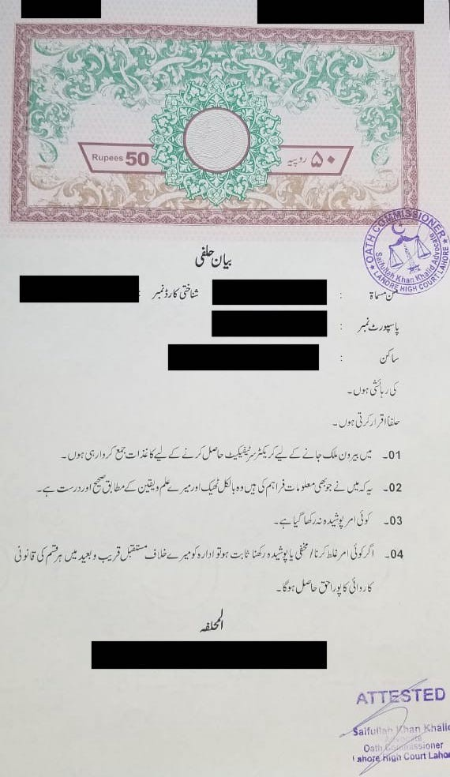
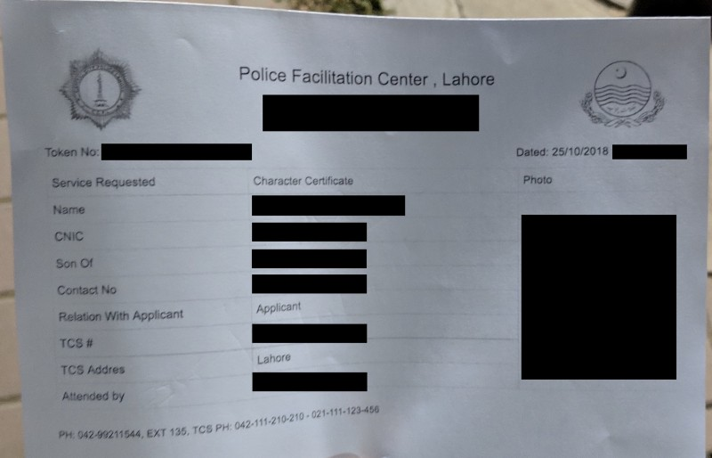

After an intense day of inquiring, I submitted my application. This is the procedure to get a Police Character Certificate in Lahore.

**EDIT AUG 2019: This procedure is now outdated. The forms have been combined into a single one, but it’s not available online. Please just show up with 1 attested photocopy of your CNIC, 1 attested photocopy of your Passport, and a passport sized photograph against a blue background for all cases. The officer will give you a form, and you’ll pay 350 PKR. You are also made to swear that you will not visit a police station, and will report any officers that ask you to visit one for an interview. Please call them to ask for clarifications. I may write a new article, eventually. Or you can.**

The procedure is fairly straightforward, it’s just not documented publicly. I submitted my application on October 25, 2018, the process may have changed at the time you read this. **It is your responsibility to check if this article is still up to date.** You can do that by calling the official sources below.

If you find that I missed something, or something has changed, please let me know in the comments below and I’ll update this article.

This guide is only valid if:

-   You’ve been living in Lahore, Punjab, Pakistan.
-   You’re in the country and are applying in person for your own certificate — a variation of this process allows for character certificates for people outside of Pakistan, but I can’t speak for that first-hand.
-   You hand these documents over to the officer personally.
-   This guide **may** be valid if you’re not a Pakistani citizen. A close friend of mine was kind enough to point out that you can simply omit the CNIC requirements, and you’ll be good. He tells me that the officers were confused when he submitted his documents, but after confirming with their superiors, they filed his application like normal.

Official sources:

-   The official Police Character Certificate Facebook Page is [here](https://www.facebook.com/Police-Character-Certificate-467867630222415/).
-   The Punjab Police Facilitation Center in Gulberg is at [G85V+RW](https://plus.codes/8J3PG85V+RW).
-   The Punjab Police Facilitation Center in Iqbal Town is at [8J3PG79V+V4](https://plus.codes/8J3PG79V+V4).
-   The contact numbers for the Incharge district Security Branch, Lahore are  
    _04299211544_, _04299211545_, _04299211546_, and _04299214847_. These are on the Character Certificate form. I called the first one, and asked to be forwarded to the “Character Certificate branch”; which they did.
-   The email address on my Police Character Certificate is [pkm.lahore@punjabpolice.gov.pk](mailto:pkm.lahore@punjabpolice.gov.pk).

### Preparing Your Application

To submit an application for a Police Character Certificate, you’ll need:

1.  1 filled out English application form, available [here](https://www.facebook.com/467867630222415/photos/a.468274583515053/468274526848392/?type=3&theater) — yes, the official form download link is a facebook photo.
2.  1 filled out Urdu application form, available [here](https://www.facebook.com/467867630222415/photos/a.468274583515053/468274646848380/?type=3&theater) — yes, the official form download link is a facebook photo.
3.  3 (or more) **recent** passport sized photographs against a blue background — this has to be very recent, mine was rejected so I immediately got a new one taken.
4.  2 photocopies of your CNIC (front and back) attested by a gazetted officer — the attestation is **required**.
5.  1 photocopy of your passport’s first full-page attested by a gazetted officer — the attestation is **required**.
6.  1 affidavit explaining the reason for your obtaining a police character certificate, and testifying that the information provided is accurate — attested by an oath commissioner on a 50 PKR non-judicial stamp paper.

_N.B. An attestation by a gazetted officer is where a Government employee signs and stamps your document, attesting its validity. Is this a great way to attest documents? Probably not, and there are_ [_plenty_](https://www.dawn.com/news/1142784) [_of_](https://www.pakistantoday.com.pk/2016/09/07/attestation-of-documents/) [_OP-eds_](https://www.thenews.com.pk/print/193365-Verify-the-verified) [_written_](https://www.thenews.com.pk/archive/print/302296-getting-documents-attested-a-hard-task-indeed) _on the matter, but a critique is out of scope for this article._

**If** you’ve listed multiple addresses in the form (#1 above), then for every additional **unique** police station, you’ll need:

-   A photocopy of your Urdu form (see #2 above)
-   An extra photograph (see #3 above)

If that was hard to understand, let me explain:

-   If you lived in two addresses, both under the Garden Town police station jurisdiction, you don’t need to worry.
-   If you lived in two addresses, one under the jurisdiction of the Garden Town police station, and another under the jurisdiction of the Iqbal Town police station, you have **one additional unique police station**, and so you’ll need to attach another Urdu form and photograph.

**About the Form**

Everything in the form is fairly obvious, but I didn’t know what my area’s police station was. I tried finding a non-emergency police helpline for Pakistan, but all their websites just said to call the emergency 15 number, so I did. The guy that answered was really helpful. He looked up the police station for my address, and I just wrote it in.

**About the Affidavit**

You can get it from any stamp-paper vendor, they’re very common. Google “stamp paper vendor near me”, or “stamp _farosh_”, or ask your local shop-keeper for the nearest stamp _waala_.

The stamp paper vendor should have a sample document for Police Character Certificate seekers on-hand. But if not, show them this picture.

After you have everything, run through this checklist one last time:

-   Urdu form(s)
-   English form
-   At least 3 **recent** photos
-   2 **attested** CNIC copies
-   1 **attested** passport copy
-   Affidavit

You will also need to bring your original CNIC card along for verification.

### Submitting Your Application

Submit your application **in-person** between 9am-8pm on weekdays at either the Iqbal Town Police Facilitation Center or the Liberty Police Facilitation Center.

I went at 6:30 PM on a Thursday to the Liberty center, it’s the same center where the Traffic Police accepts Learning Permit applications, but these documents were submitted through a window on the outside.

When I went there:

-   The place was deserted
-   There were no people standing in line
-   Only the Senior Citizens window was open, and
-   I submitted my papers through that window

The officer:

-   Told me how lucky I was since the power had just come back
-   Asked me to hand over my CNIC
-   Took a picture of me through an ancient webcam model I used when I was 14 and really into Yahoo Messenger (RIP)
-   Told me how finicky people were about their pictures when I told him mine was terrible
-   Asked me to pay 100 PKR as the TCS delivery fee for the certificate
-   Gave me a piece of paper to check my details on and sign
-   Handed me a receipt.
-   Told me I’d get the certificate in the mail in, a week

### The Interview

Depending on your gender and the person handling your case, you may either:

-   Be interviewed on the phone
-   Be asked to show up for an in-person interview

In my case, on October 27, my local police station called and asked me to come with my wife’s and my own CNIC cards — on a Saturday — in an hour, without any consideration for my plans. The officer — _very politely_ — asked me the following questions:

-   Have you ever dealt in “black market” goods? — I just said no, even though I **really** wanted to ask him to define “black market” goods. Such a curious and vague term. How deliciously the expression on the officer’s face would change when I made him realize that his own iPhone (clearly not PTA approved) was a “black market” good.
-   Have you ever been prosecuted in a court of law? — I said no, but because the question he actually asked was, “have you ever appeared in court?”, I explained to him that I’d filed Writ Petitions through counsel, obtained a court order, and was currently in the middle of a Writ Petition against the Federal Government. He should’ve really just asked me if I did or had had any criminal cases registered against me.
-   Can you confirm the details you submitted in your application? — Yeap, I submitted my application truthfully, and then the filing officer changed stuff to make it easier to processes bureaucratically. I told him about this, and he was okay with it.
-   Do we need to verify where you live? — This was an odd question. If I’d answered negatively, that’s something a guilty person would say, but if I answered positively, that’d be like condemning myself. Damned either way, I decided to give him an odd answer, “do whatever you need to to get me the best certificate you can”. That was probably not the best answer, but hey.

On October 28, my wife received another phone call from the police station in whose jurisdiction she used to live. They asked her one question:

-   Did you live at your previous address, and then move to your new address after you were married? — She answered in the affirmative. The man thanked her and hung up.

### The Delivery

_On Oct 31, 2018 the Supreme Court of Pakistan_ [_exonerated Asia Bibi in a blasphemy case_](https://www.theguardian.com/world/2018/oct/31/asia-bibi-verdict-pakistan-court-overturns-blasphemy-death-sentence) _and overturned the death-sentence (awesome!). This led to mass-riots across the country (by people with fecal filled craniums), destruction of public & private property, and a lot of general disruption._

At the end of the day on November 5th, 2018 a full _eleven days_ after my application I called the number on the bottom of my receipt to ask where my certificate was. The officer told me that the certificates had been picked up for delivery, and should be delivered soon. The delay was because of the riots.

On November the 6th, my Police Character Certificate was delivered to me.

---

**And that’s it. Just that. Nothing else. 100 PKR and you’ll get your Police Character Certificate in the mail in a week. You’re welcome.**

Honestly, I can’t believe how many people get their certificates made, and no one took the time to document it.

If you get a Police Character Certificate issued while overseas, or if you’ve figured out another bureaucratic process, document it and leave a comment below.
