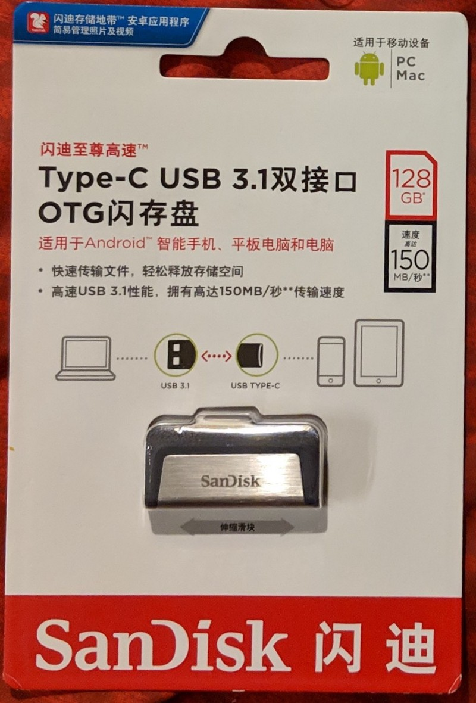

There are plenty of [stories about fraudulent](http://sushifury.com/2010/03/i-got-sold-a-fake-usb-flash-drive-on-ebay-heres-how-i-fixed-my-situation-and-how-you-can-avoid-this-situation-yourself/) USB flash drives floating around. This isn’t one of those, I bought a 128 GB USB 3.0 Type C & A SanDisk Flash Drive, and it works great. If you want to buy the drive, click [here](https://www.aliexpress.com/store/product/Sandisk-SDDDC2-Extreme-Type-C-128GB-64GB-Dual-OTG-USB-Flash-Drive-32GB-Pen-Drive-USB/1161762_32842000295.html?spm=2114.12010610.8148356.5.1e3b51f8WWGFrn&spm=a2g1y.promotion-20181111.hotSpots_7041394.0). I am not affiliated with the seller, I get no referral commission for this link.

You should reproduce these tests for every suspect USB you buy as well. The tool I used is [f3](https://github.com/AltraMayor/f3) (Fight Flash Fraud), and it tests the device’s real:

-   Write Speed — 43.33 MB/s
-   Read Speed—112.24 MB/s
-   Capacity—114.53 GB

These numbers, while fairly high, nowhere near the levels written on the packaging, but I’m okay with that. Realistic benchmarks are never as high as theoretical.

My tests were conducted over the USB C interface, while connected directly to a 2016 Macbook Pro. Here are the raw results:
