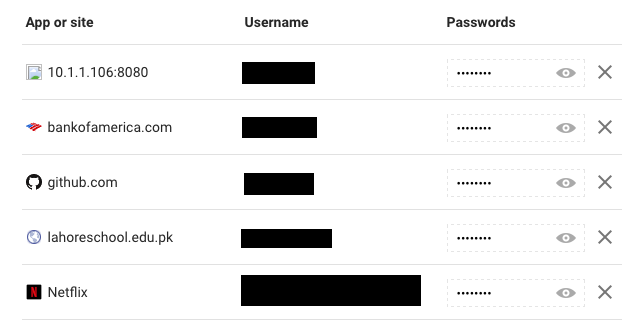

Don’t use Chrome’s built in Password manager, it syncs to your Google Account where passwords are viewable in plaintext. Have you ever saved a password in Chrome, even accidentally? Go to [passwords.google.com](https://passwords.google.com/)

Ever given your Google password because you couldn’t access your email? They can wire your savings to themselves.

Just got out of a serious relationship? Your ex probably piggybacks off your Netflix subscription, and stalks your instagram.

#### Why is this a problem?

-   I’ve seen a real world case where a Google account compromise led to a takeover of social media accounts unrelated to the address.. this was the only place where the passwords were stored
-   This defeats resetting the victim’s password to gain entry into their accounts, and allows for “silent” stalking after obtaining the Google password.

#### How do I protect myself?

Read [my guide](https://www.toptal.com/remote/best-security-practices-for-remote-teams#contract-just-respected-software-architects), and use LastPass:

-   Client side encryption
-   Cross platform and free multi-device support
-   Have [1 free month of premium](https://lastpass.com/f?3909636)

#### Disclosure:

-   May 18: Contacted Google and proposed short-term solutions
-   May 18: Google triaged and put into queue
-   May 24: Not considered a security bug.. oh well.
