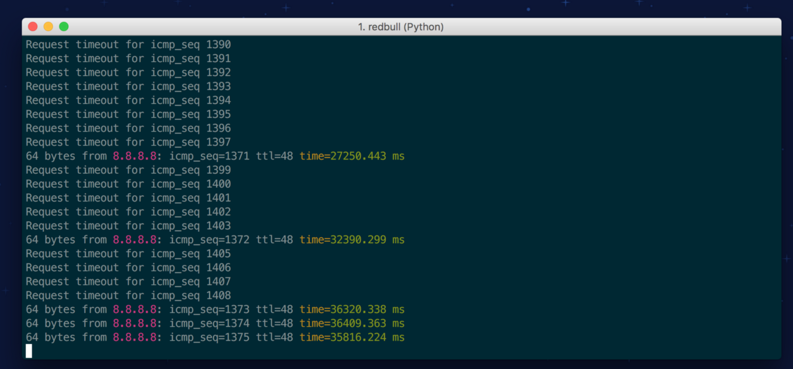
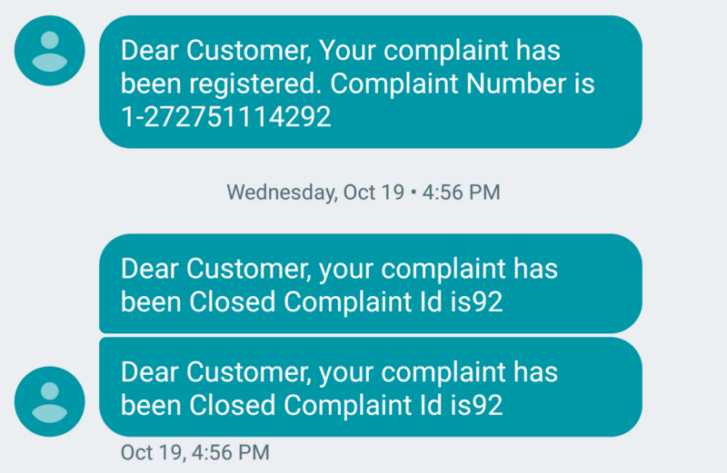
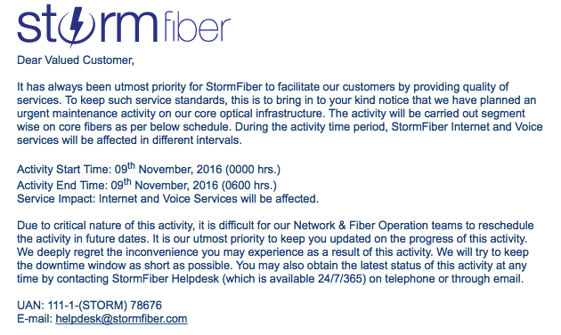

Dear PTCL

I started using PTCL broadband in 2008. It was my first time upgrading from dialup, and boy was it fast. I remember when I first watched an entire YouTube video without buffering, and it felt too good to be true. I couldn’t stop running speedtest over and over again.

I pirated more music than I had time to listen to that first week because I could, because I didn’t need to wait 3 hours for a single mp3 file to finish, because it was so much fun.

> You should make friends with your local broadband technician, and call him up personally when something goes wrong. They handle things better when they have your personal number  
>  — Past me.

I still remember how I loved recommending you to my friends, even those that claimed to have had a terrible time with PTCL BB. I told them workarounds and hacks to make PTCL work for them, even when they had the problems like intermittent connectivity.

> Try upgrading your phone line from plain old copper wire to fiber optic. It’ll help with the signal quality.  
>  — Past me.

You were my first, and I had hoped you’d be my last. We had a good eight years together, but somewhere along the way, you changed.

#### You’ve changed

I don’t know when it started, but you began to care less about me. Slowly my complaints began to go unresolved. I began getting “complain resolved” checks before the complaint had been resolved. Your reps would hound me to say “yes” on the prompt even before I had checked if the internet was working, even if I was at work.

Your service would intermittently shut down, and start up again, and you would be too lazy to check up on it.

Last month I got so fed up, I [programmed a watchdog](http://github.com/amingilani/scruffy) to test connectivity periodically, and found conclusive evidence that my connection wasn’t working. I called your helpline, I yelled, screamed, threatened, and cried, but it was like you just didn’t care anymore.

> Once my Broadband technician couldn’t figure out what was wrong with my connection. So I printed out the ADSL stats for him, and compared them to the optimum ranges, and pointed out the problem for him. He fixed it immediately. Sometimes all they need is a little help  
>  — Past me.

I had the stats to show you how my internet quality would randomly drop, how my latency would hit 5–6 seconds, and how my speedtest would drop below 1Mbps frequently, but for three weeks, you never called me. I would continue to get a prompt asking me if my connection issue was “resolved”, but it wasn’t.

But then one day you closed my complaint without even asking me. Despite me having screamed at your representative that I wasn’t home and I couldn’t tell until I had checked.

That was it. That was the moment it all made sense: you didn’t care about me anymore. Somewhere along the way, you became so distracted by being the big ISP that you forgot it was I, your loyal subscriber, that brought you so high. You did exactly what you had promised you’d never do: you took me for granted.

I’m sorry PTCL, but it’s over. And it wasn’t me, it was you.

#### I’m moving on

Today I watched a technician install a StormFiber connection at my house. They charge about the same as you do, but they give me 10x the speed. The best part, their support rep walked me through the sign-up process personally and apologized profusely whenever we (inevitably) hit a snag or two.

I want you to know something though. It wasn’t one component of your service that failed me. It was your business process and company as a whole. It was you PTCL, it was all of you:

-   Your support didn’t seem to have any real power over my issues.
-   Your technicians didn’t care
-   Your engineers don’t seem to have any automated service quality checks
-   Your automated voice feedback doesn’t care if I’m not at work
-   Your management doesn’t seem to see these problems
-   Your systems don’t raise flags when someone raises multiple complaints in a row in a single week

I want you to know PTCL, you’ve failed me, you could have prevented this from happening, but you didn’t, and now it’s too late.

Take your things and pack up, I don’t want your internet anymore. You’re not getting my router back because you said I could keep it if we were together long enough. We were, but now we aren’t. Goodbye PTCL, I’m moving on.

_PS- At 20mbps, stormfiber is 10 times faster, I don’t know what you’ve heard, but speed_ **_does_** _matter._

---

A copy of this letter was sent to PTCL, as part of my application to close their Broadband service.
