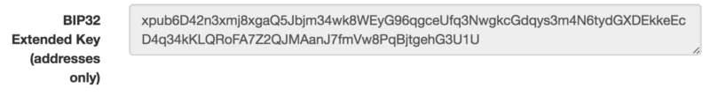

I love Bitcoin. Despite having jumped in and out of the blockchain world numerous times over the years, I love cryptography, currency, and cryptocurrencies. I did, however, always have trouble with cold-storage because I knew I could not secure my coins as well as Coinbase’s Vault… until now.

There’s also the fact that Coinbase only supports BTC and ETH. I love Bitcoin because it was the first and is the most popular crypto, but I get excited by all the new crypto contenders. Especially those whose innovations were rejected by the puritanical Satoshist cult, that is Bitcoin. (cou-ZCash-gh)

That’s why I got excited by the [Ledger Wallet](https://www.ledgerwallet.com/), and it’s support for multiple cryptocurrencies. I’m no longer an active Shibe, but if I buy a hardware wallet, I bloody well want to store my Dogecoin and Litecoin on it! On top of this, the companion apps are open source!


I bit the bullet this black friday and bought a Ledger Nano S on sale! This is a story about how you can keep your Nano S in a safe place (say, a bank vault) and yet use the HD capabilities to create a “watch-only” wallet and send bitcoin to it. It combines bank grade cold-storage security with the ease of an always available deposit address.

### Steps

To do this, you’ll need to:

1.  Setup your Ledger Wallet
2.  Get the HD Public Key
3.  Import the HD Public Key into Mycelium
4.  Secure your Ledger Wallet

#### Setup your Ledger Wallet

Follow the instructions that come with your Ledger Wallet, and safely write down the 24 word mnemonic seed.

#### Get the HD Public Key

Bitcoin, having its roots in cryptography allows a mechanism to derive private keys from a root public key. The whole thing is outlined in [BIP32](https://github.com/bitcoin/bips/blob/master/bip-0032.mediawiki) but to summarize overly simplistically:

```
Root Key → Child PrivKey(n) → Wallet PrivKey(i)→ WalletPubKey(i)
            ↳ Child PubKey(n) _____________________⤴

* Where Pubkey(x) corresponds to Privkey(x)
```

This means you can store a Public key on your phone, and use it to derive wallet addresses. A thief that steals your public key won’t have access to your bitcoin, but will only be able to see your balances.

You can safely store the Private key separately (in your Ledger Wallet), and use it only when you need to spend your coins.

The format for deriving wallet addresses is standardized in [BIP4](https://github.com/bitcoin/bips/blob/master/bip-0044.mediawiki)4, and you should read the BIP to understand the rationale behind it. But for bitcoin, the path is defined as:

```
m/44'/0'/0'/i

* Where m represents the master key
* Where /x represents the xth derived child key in the sequence
* Where i represents the sequence number of the key
* Where ' denotes that the child key is hardened.
```

The format for storing the master key via mnemonic words is outlined in [BIP39](https://github.com/bitcoin/bips/blob/master/bip-0039.mediawiki), and those are the 24 words your ledger wallet made you backup.


So, to find the HD Public key for your wallets:

1.  Open the Ledger Wallet Chrome bitcoin app
2.  Click your account in the overview, it’s called “My account” by default
3.  Click “Account Settings” in the top right corner, under the balance
4.  Click “Export” next to “Extended public key”
5.  And when you see the QR code pop, you’re ready to begin the next part.

#### Import the HD Public Key into Mycelium

There are plenty of wallets that allow you to import an HD Public Key, but Mycelium has the most straightforward process. I’ve managed to get it done in Copay as well, but for now, we’ll stick to the easiest.

](./asset-5.jpeg)

1.  Install the [Mycelium Wallet](https://wallet.mycelium.com/) on your phone
2.  Scan it the QR code from the first part in Mycelium via Accounts > Add Key Icon > Advanced > Scan (Fig 4.)
3.  Verify that your first recieving address in Mycelium is the same as the address in your Ledger Wallet
4.  Done!


#### Secure your Ledger Wallet

If you’re super paranoid, put your Ledger Wallet in a bank vault, and distribute the master key mnemonic using [Shamir’s Secret Sharing](https://en.wikipedia.org/wiki/Shamir%27s_Secret_Sharing) in different places.

But for me, I’ve put the master private key in a bank vault, and knowing that your only get 3 PIN tries before the Ledger Nano S resets itself makes me pretty confident that I can keep it in my home safe.

### Conclusion

The Ledger Wallet allows pretty flexible measures to save your coins, and I find that it allows you to fulfill the Be Your Own Bank bitcoin popularized.

I love the multicurrency feature, and I now have one wallet to rule them all!

---

If this helped. I’m looking to foray into the world of ZEC and ETH, shoot some into my bank grade vault here:

-   ZEC: `t1b6GjaCooSV4j29BQYqAVwUBJWj9faNYhS`
-   ETH: `0xEC2B8960556f952fF7422B9EF0F6566b465CA429`
