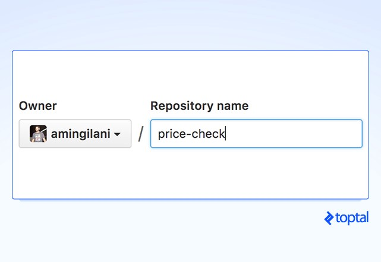
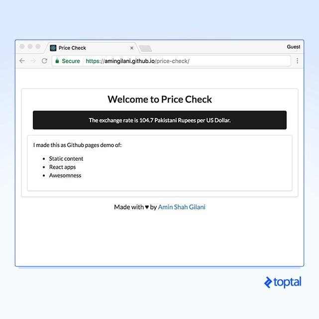
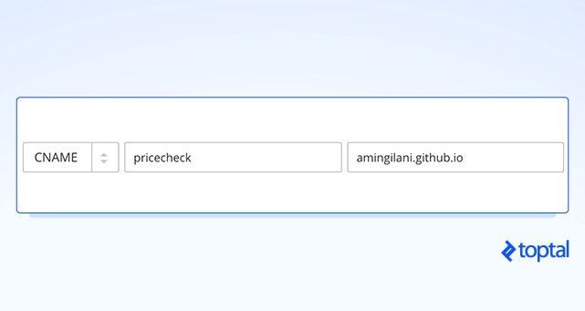
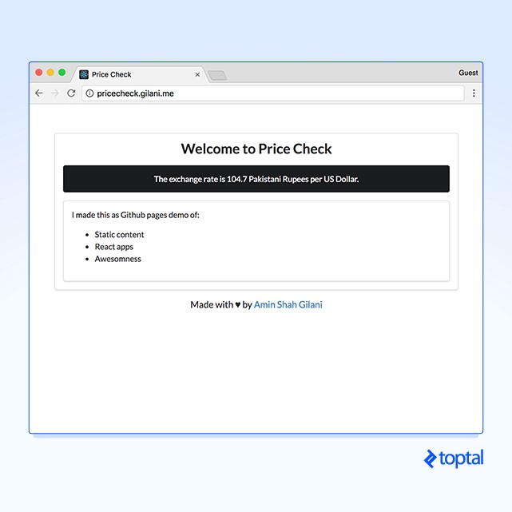
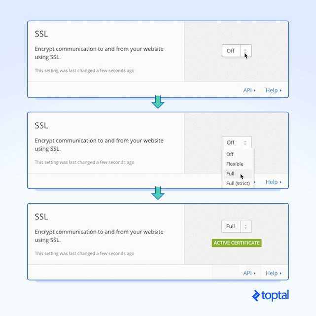
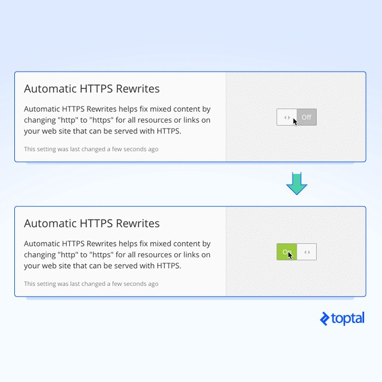
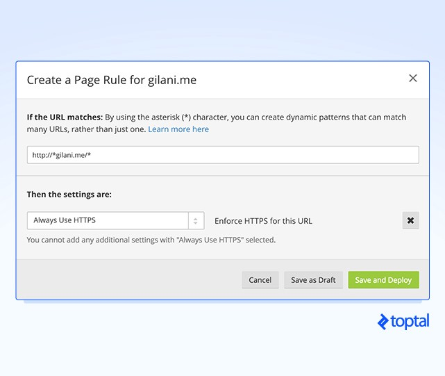

I have a secret that saves my clients a ton of money, keeps their website secure, and has built-in backups.

The secret: I make their website static. Then, I store and host it with GitHub, and use Cloudflare to serve it over HTTPS, and make it fast. My clients only ever pay for their domain name, yet they get a lot more than they ever bargained for.


### Why Static Content?

Static sites are wonderfully fast since there’s no server processing time involved. Also, by committing a code base of static assets in a git repository, rolling back changes simply becomes a matter of reverting to a previous commit. Backups are a `git push` away, and you essentially serve your entire website from the cache, meaning your server will almost never have to process a request again.

Building a complex UI?

With the advent of front-end frameworks, like React and its kin, you can create magical experiences with nothing more than HTML/CSS and JavaScript. You’ll have to separate your back-end logic from your front-end though, but even Ruby on Rails ships with an API mode now.

Whenever I get contracted to build a website, I consider whether or not a static site is enough to meet my client’s needs, and in many cases, it is.

Are you wondering what sort of use cases I have in mind? Great! Let’s discuss some situations when you may want to consider static content, and explain how this approach can save both you and your client’s time.

### Brochureware websites

Brochureware websites are meant to provide information about a business, and don’t change significantly throughout their life. A dynamic application is clearly overkill for such sites, and since these sites go unmaintained for years, receiving few, if any updates, they’re usually easy targets for hackers to, well, hack.

Static HTML templates are significantly cheaper than their CMS counterparts, and they are easier to tweak in the future. Developers asked to update such sites don’t require specialized knowledge about a particular CMS. As a rule, I always make static websites for brochureware sites.

**Bonus:** Small businesses love not paying recurring monthly hosting fees. Granted, hosting is not a huge cost, but clients just don’t have to bother paying anything other than the domain, which is great.

### Single-page applications

Are you showing off a wonderful, cool new app that relies on modern front-end frameworks?

Your application is already mostly static. Take a few extra steps to isolate any server side logic into a separate application, and get the full benefit of having your app served entirely from Cloudflare’s cache.

Your application will be available at all times.

### Blogs

This is a tough sell. It’s hard to convince people static sites can be employed for blogs, but read me out — I haven’t gone off the deep end.

Blogs are nothing more than content rendered with templates. You simply don’t need a full-blown application parsing each request and rendering a new page. A static site is perfect for this use case.

Consider [Jekyll](https://jekyllrb.com/). You give it [Liquid](https://jekyllrb.com/docs/templates/) templates and Markdown content, and it combines them together into a static website. No on-the-fly processing required, and your blog suddenly feels significantly faster.

This workflow is especially helpful because GitHub pages support Jekyll builds. Suddenly, blog posts can be contributed with pull requests, and all your content is stored within version control. Non-developers can still contribute posts in Markdown by publishing their posts through [Stackedit](https://stackedit.io/).

In fact, I’m using Stackedit to compose this post right now!

Also, if you want comments on your blog posts, [Disqus](https://disqus.com/) gives you a powerful comment system by inserting a snippet of JavaScript.

This page that you’re reading uses Disqus too.

### GitHub Pages

GitHub Pages is GitHub’s answer to project pages, and it allows you to serve any static website straight from your repository. Since GitHub pages support custom domains, you can host a static website on GitHub pages free of charge, with deploys straight from Git.

### Deploying to GitHub Pages.

Enough talk, let’s see it in action!

I’ve gone ahead and made a [single page React app](https://github.com/amingilani/price-check) that fetches and displays the current exchange rate for the Pakistani Rupee from a public API. Let’s deploy this to GitHub Pages.

First, let’s create a new GitHub repository.



New GitHub Repo

GitHub pages are served from a branch called `gh-pages` so let’s create one for my project.

```
$ git checkout -b gh-pages Switched to a new branch 'gh-pages'
```

And let’s push the site up:

```
$ git remote add origin git@github.com:amingilani/price-check.git $ git push -u origin gh-pages Counting objects: 27, done. Delta compression using up to 8 threads. Compressing objects: 100% (25/25), done. Writing objects: 100% (27/27), 28.67 KiB | 0 bytes/s, done. Total 27 (delta 3), reused 0 (delta 0) remote: Resolving deltas: 100% (3/3), done. To github.com:amingilani/price-check.git * [new branch] gh-pages -> gh-pages
```

And we’re done! At this point the website will be available at `https://amingilani.github.io/price-check` with free SSL:



Site hosted on GitHub pages

**Important things to note:**

-   GitHub pages serves the `index.html` file in your project’s `gh-pages` branch
-   The website is served at `USERNAME.github.io/REPOSITORY-NAME`

### Customizing the domain name.

Serving the site off GitHub is fine, but any decent website needs a custom domain name. Luckily, GitHub lets you _Bring Your Own Domain_ to the party!

First, let’s create a special `CNAME` file and place our domain name there. This will let GitHub know which domain name to route to the repository.

```
$ echo 'pricecheck.gilani.me' > CNAME $ git add . $ git commit -m 'Add a custom domain' ... $ git push ...
```

Second, let’s point a `CNAME` for our **subdomain** to GitHub’s DNS at `USERNAME.github.io`:



Point a CNAME to our domain

**Caution:** _Do_ **_NOT_** _use this for an apex domain! Adding a_ `_CNAME_` _record to the root your domain will disable your_ `_MX_` _and_ `_TXT_` _records. Use this only for your subdomain. Apex domains are discussed later._

At this point, our website should run on our custom domain on HTTP:



Configured to use a custom domain

Important things to note:

-   The default `*.github.io` domain is served through HTTPS.
-   Our custom domain name is served through insecure HTTP.
-   Do **NOT** use a `CNAME` record on your apex domain unless you want to kill your emails.

[Limitations](https://help.github.com/articles/what-is-github-pages/) of GitHub Pages:

-   Repos must be less than 1 GB in file size.
-   Websites must be less than 1 GB in file size.
-   Monthly Bandwidth limit is 100 GB. _We’ll bypass this later on._

### Using an apex domain as your custom domain

The easiest way to get around this limitation is to use `www` as your subdomain, and redirect all HTTP traffic from the apex to `www`. In my example, I would redirect `gilani.me` to `www.gilani.me`, which points to my static site, but I don’t like doing things the easy way.

If you really want to use an apex domain, check if your DNS provider lets you set `ANAME` records. These are (simplified) halfway between of `CNAME` records since they let you point to domains and `A` records since they don’t nullify other records on the same zone.

No `ANAME`? The last option is to change to a DNS provider that does support this: enter Cloudflare. Cloudflare provides `[CNAME](https://support.cloudflare.com/hc/en-us/articles/200169056-CNAME-Flattening-RFC-compliant-support-for-CNAME-at-the-root)` [flattening](https://support.cloudflare.com/hc/en-us/articles/200169056-CNAME-Flattening-RFC-compliant-support-for-CNAME-at-the-root) on apex domains, which is the equivalent of an `ANAME` record. It’s best to make the switch right now since we’ll be covering Cloudflare in the next section.

**TLDR**: _Switch to Cloudflare’s free DNS and set a_ `_CNAME_` _on your apex domain. They do something special with their_ `_CNAME_` _that makes it work._

### SSL and Cloudflare

Welcome to the post-Snowden era. All our worst fears of government-sanctioned snooping and hacking have been confirmed, and the world is scrambling to secure data in transit and at rest.


Encrypt all the things

As a modern web admin, you’re expected to provide at least SSL on your website, with **no mixed content**.

It’s come to the point where [Google Chrome marks plain HTTPS websites as insecure](http://www.pcworld.com/article/3118164/security/google-chrome-to-start-marking-http-connections-as-insecure.html) and [Google Search is beginning to favor HTTPS websites more favorably in their rankings](https://thenextweb.com/google/2015/12/17/unsecured-websites-are-about-to-get-hammered-in-googles-search-ranking/). We’ll discuss even more strategies for making your front-end secure later, but for now, we’ll only cover SSL.

Fortunately, we now have [Let’s Encrypt](https://letsencrypt.org/).

It’s a non-profit and entirely automated Certificate Authority (CA) that lets you programmatically issue short-term 90-day SSL certificates for any domains you control. It’s a breeze to use; it’s open source; and the project is backed by a plethora of companies, including Mozilla and the Electronic Frontier Foundation.

### Putting Cloudflare to Good Use

Cloudflare is a DNS, CDN, and DDoS protection service.

It caches your website, and serves it to users from servers geographically close by, making your website faster. It has the added benefit of keeping you under GitHub’s 100GB bandwidth limit because even if your website becomes insanely popular, most requests will hit the cache, and never reach the server.

On top of this, Cloudflare offers a service called [Universal SSL](https://blog.cloudflare.com/introducing-universal-ssl/) where they issue you a free SSL certificate from their CA partners, so you get HTTPS for free… forever.

### Why Cloudflare?

I know what you’re thinking: Gilani, you just told me how awesome Let’s Encrypt is. Why are you talking about Cloudflare? Well, it all comes down to simplicity.

As a mental exercise, imagine setting up multiple Nginx cache and reverse proxies around the world, giving them all valid SSL certificates and serving users web pages from their closest locations.

This results in your website being served via SSL even if the origin server doesn’t have an SSL certificate, although Cloudflare gives you special self-signed certificates that you can put on your origin server to secure the connection up to Cloudflare’s servers. This is what Cloudflare gives you with a free plan, and you don’t even have to renew your certificate every 90 days.

As a freelancer, I get clients who want a site up and running for their business as fast as possible. They don’t understand or care about security concerns, plaguing the modern web, or encryption during transit. Some clients struggle to understand the idea of domain names, and find it annoying when they have to pay a $15 annual fee “just to keep my website running”. So try explaining to them why they have to pay for a cluster of reverse proxies protecting their website that runs on free hosting itself.

### Setting up Cloudflare SSL

Let’s get our hands dirty again. The first thing to do, switch to routing all of your traffic through Cloudflare:

DNS and proxy

Next, under Crypto, set the SSL level to “Full.”



Switch crypto to full

Force “Automatic HTTPS Rewrite” to kill mixed content warnings.



Enable Automatic HTTPS Rewrite

At this point, our website will work over both HTTP and HTTPS. Let’s force HTTPS for everything on our domain.



HTTPS everywhere

All done. Our website should always load over HTTPS with a green “Secure” rating in Chrome.


There are a few things I didn’t discuss above, and I’d like to take a moment to clarify a few points.

The astute among you will point out that there are a few glaring security problems with this setup, namely that there are no secure HTTP headers like:

And you’re right. GitHub pages and even Cloudflare _do not allow you to customize your HTTP headers_. However, you can set a CSP using the HTML `[meta](https://developer.mozilla.org/en-US/docs/Web/HTML/Element/meta#attr-http-equiv)` tag.

Simply insert this into your web page:

```
<meta http-equiv="Content-Security-Policy" content="default-src https:">
```

However, at the moment, there is no practical way to set the `X-Frame-Options` header on GitHub pages, meaning an attacker can load your webpage into a specially crafted `iframe` and pull off an XSS attack. If you’re dedicated, though, you can workaround this issue by asking users to confirm their password or 2FA token upon every sensitive action, or by passing a [CSRF token](https://en.wikipedia.org/wiki/Cross-site_request_forgery#Prevention) upon every authenticated request.

A major concern to some is that by using the free public repositories at GitHub, your website and source code is available to anyone that wants to fork or download it. So I think the concern here is misplaced.

Static content isn’t source code in the sense that it isn’t compiled or processed as a script before being served to the user. Your user will get the exact same static copy of the website if they were to run a web crawler pointed at your website. While hosting the code in a GitHub repository certainly makes it easier to download a copy of your website, it doesn’t expose anything that wasn’t already public.

### Scaling, Unlimited Scaling

The ideas presented in this article are not limited to free web hosting of small applications.

You can build a front-end layer based on a modern JavaScript framework, hook it up to a large scale cloud-based Backend-as-a-Service (BaaS), like [Firebase](https://firebase.google.com/), and create complex applications without worrying about servers, uptime, or any other infrastructure related issue.

Making a new exciting web based game?! Check out [GameSparks](https://www.gamesparks.com/), and you are good to go.

Using Github Pages as a “standard” hosting service, that is expected to handle high bandwidth websites, is discouraged and should not be done. Adding Cloudflare CDN on top of GitHub Pages makes this solution work. Cloudflare is much more than a free SSL service. It’s a company with a global CDN that protects your website from surges and keeps the load on GitHub pages minimized.

In this article, I made it appear as though I manually published my React app to `gh-pages`. I did no such thing. I worked on `master` and when it came time to deploy, I ran `npm run deploy` which kicked off a build script and pushed the build to `gh-pages`. Please see the `master` branch of my repository to see how it works.

### Takeaways

**Pros:**

-   Instant deployment
-   Easy collaboration
-   Secure hosting environment

**Caveats:**

-   No access to HTTP headers
-   Easy to download a copy of the website
-   GitHub knowledge required
-   Depends upon technology vendors

**Links:**

---

_Originally published at_ [_www.toptal.com_](https://www.toptal.com/github/unlimited-scale-web-hosting-github-pages-cloudflarehttps://www.toptal.com/remote/best-security-practices-for-remote-teams#contract-just-respected-software-architects)_._
