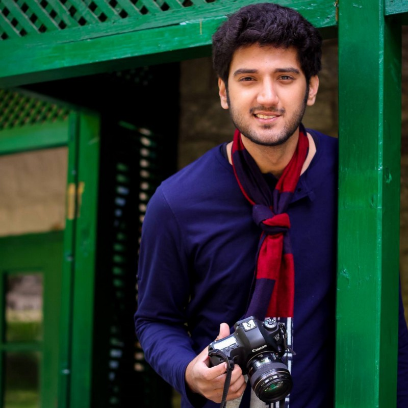
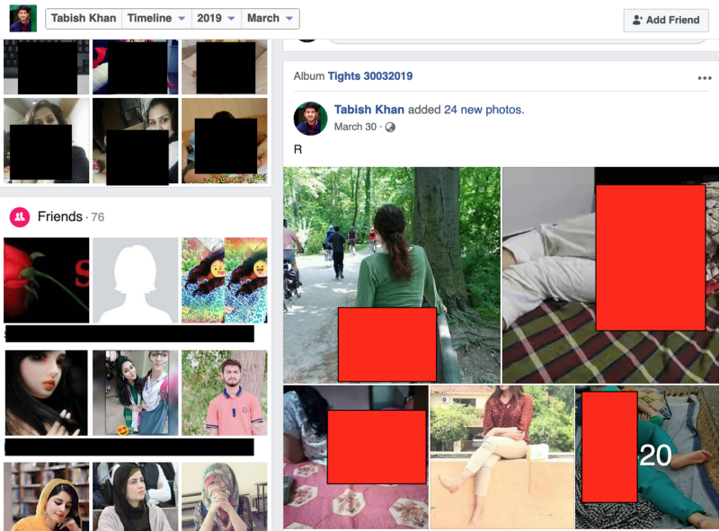
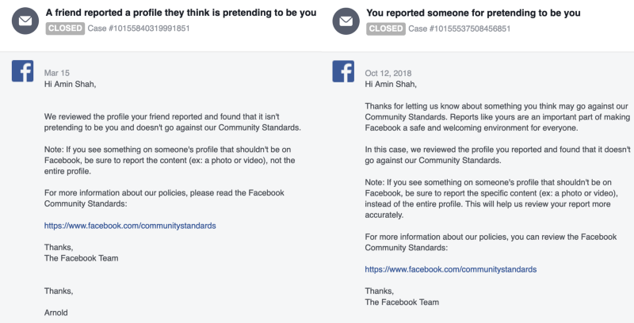
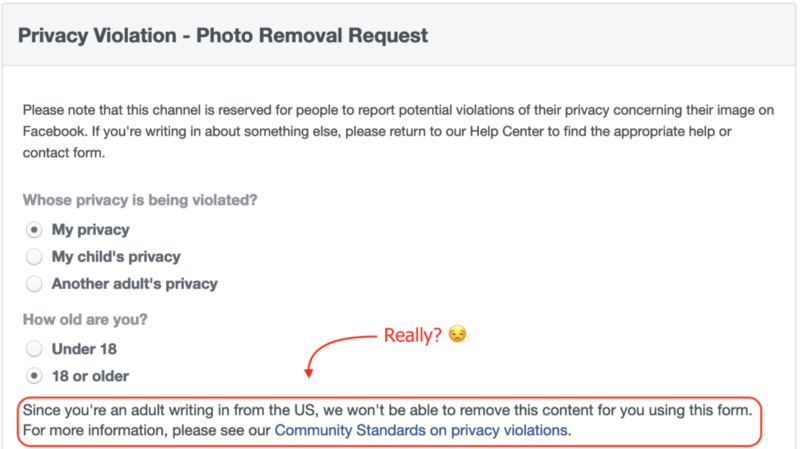
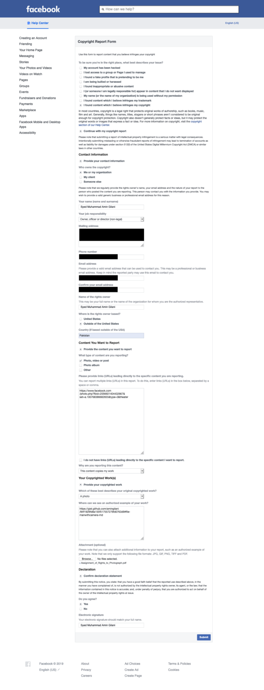
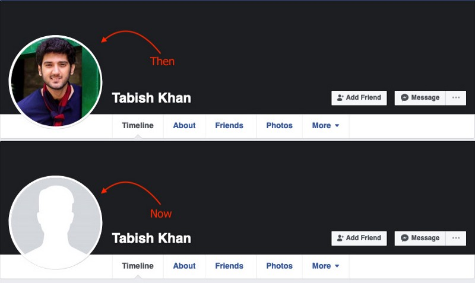

Fake profiles are the scourge of online communities. I don’t mean bots, not at all, as a [developer](https://topt.al/cppg), I love making bots that are helpful to people. I created one that reminded me to take my medication, or it would complain to my wife — until the Pakistan Telecommunications Authority decided to [ban Telegram](https://medium.com/@gilani/lhc-set-to-hear-citizens-appeal-to-constitute-federal-information-commission-on-thursday-e332f2172ef9?source=your_stories_page---------------------------), but that’s another story. By fake profiles, I mean the ones that pretend to be real people, in order to hide their true purpose. I suppose I’ll never truly know what the profiles I found were really about, but I’m the only person I know that’s successfully disarmed Facebook trolls.

This is a story about how I used copyright law to essentially remove my picture from fake profiles. I bought the copyright to a picture of mine that was being used by inauthentic accounts, and used the copyright to have Facebook the image down. In the end, even though these accounts weren’t bots, if you’re planning on running a good bot, you may qualify to use the same image.

#### Background: A Photo is Taken

In mid-2015, I went on a trip up to Hunza Valley, in the Gilgit-Baltistan region of Pakistan. 10/10 recommend the place, 0/10 do not recommend the bus ride there. Anyways somewhere up there, broke-23 year old me, then 30 kilos lighter, untouched by the stress of running a startup or being on-call 24/7 for site reliability work was walking around mulling over his then-new startup idea, taking pictures. It was at that moment when a then-amateur photographer, Shayan Ather, decided to take a photograph of me. Looking back, I looked pretty damn good for a dude in a 2 year old shirt, and a scarf I never learned how to tie.

The trip ended, I went home. Life went on. Shayan, the photographer, put the photo up on her Facebook page, but later took it down — guess my face wasn’t beautiful enough, but I doubt that. I used the picture as my profile picture once, but then it was eventually buried under newer pictures, like pictures are.

Eventually, I started working on my startup and at some point I gained modest recognition. A little [coverage](https://pakwired.com/meet-mailman-pakistans-amin-shah-gilani-wins-coinbase-bithack-v2-hackathon/meet-mailman/) and a few [articles](https://www.dawn.com/news/1222661) used the picture, since it was the only half-decent one I had. I never thought much of it, because I mean, it’s just a face. I had much bigger things to worry about in life.

#### Problem: There Are Weird People On The Internet

At some point in 2017 I started getting messages from my friends saying that a fake profile was using my picture. And boy is it awkward when people from your professional network start forwarding you things like this.

It’s not that I paid it any attention. I have fairly thick skin, and fake profiles are fairly common in Pakistan, just not for men. That said, I’ve shelled out the advice to “just ignore it” to plenty of women throughout my life. There’s hundreds of reasons why that’s great advice:

-   The best you can do is report it to Facebook, but 10 times out of 10 Facebook won’t do anything.
-   There’s no point in worrying about something you have very little control over.
-   There’s the Streisand Effect: if you try to stop a fake account, you’ll just encourage a hundred more to pop up.
-   It’s probably just someone trying to get under your skin, and you don’t really want to give them the satisfaction of knowing you care.
-   It’ll never happen to someone obscure, so if it happens to you, you must be growing out of obscurity! Bring on fame and all it’s problems, right? (Yeah, no, I’m not famous)

Of course, I never thought I’d be repeating the same advice to myself. I mean, what kind of person(s) go(es) around creating fake accounts? And why of me? I’m such a nice person! And so, I ignored it.

I ignored it again, when I got another cycle of texts from my friends a few months later. And then another one a few months after that, when my (beautiful) face was being used to sell—fumigation services?

![Translation: “Friends Fumigation Services. Actual termite eradication. Odorless chemicals. No Need to Worry about TERMITE \[sic\].” 😂](./asset-4.jpeg)

So, I continued ignoring them. I’m not saying I didn’t at least attempt to stop the spread, but Facebook was of no help in the matter.

I mean, I didn’t know what to do at this point. This was Facebook’s official statement on the matter:

> We reviewed the profile … and found that it doesn’t go against our Community Standards

But also, Facebook:

> 17\. Misrepresentation

> Do not \[m\]isuse our products by \[c\]reating inauthentic profiles  
> Do not \[i\]mpersonate others by \[u\]sing their images with the explicit aim to deceive people  
> Do not \[e\]ngage in inauthentic behavior, which includes creating, managing, or otherwise perpetuating \[a\]ccounts that are fake  
>  — Facebook Community Standards

But it appears as though Facebook’s official stance is that privacy violation isn’t a problem if you’re over 18 years of age.

And so, I took my own advice and ignored it.. until this week when I had a brilliant idea. In the absence of strong privacy laws, Facebook can play fast-and-loose with my privacy all they want, but if they ignore a copyright violation, they lose the safe harbor provided to them under Title II of the [Digital Millennium Copyright Act](https://en.wikipedia.org/wiki/Digital_Millennium_Copyright_Act). What that basically means is that if there’s copyrighted content on Facebook, and they’re notified to take it down, it’s in their best interest to take it down immediately.

Let’s troll a troll with copyright take downs.

#### Obtaining the Copyright

_Before we begin, I am not a lawyer, and none of the content here may be construed as legal advice. Also, the law may differ in your jurisdiction. Please hire an attorney._

So, copyright in Pakistan is governed by the Copyright Ordinance, 1962. Let’s use the text of the law to answer a few questions:

**Q1. What is this “copyright” in the first place?**

> 3. — (1) … “copyright” means the exclusive right, by virtue of, and subject to the provisions of, this Ordinance, —   
> …  
> _(b)_ in the case of an artistic work, to do or authorize the doing of any of the following acts, namely:  
> (i) to reproduce the work in any material form;  
> (ii) to publish the work;  
> (iii) to use the work in a cinematographic work;  
> (iv) to show the work in television;  
> (v) to make any adaptation of the work;  
> (vi) to do in relation to an adaptation of the work any of the acts specified in relation to the work in sub-clauses (i) to (iv);  
>  — Copyright Ordinance, 1962

Ah, so without permission from the copyright holder, doing anything with the “artistic work” would be unauthorized use.

**Q2. Who owns the copyright of something?**

> 13. … the author of a work shall be the first owner of the copyright therein …  
>  —  Copyright Ordinance, 1962

In our case, that makes Shayan the owner of the copyright.

**Q3. Can I obtain the copyright from Shayan?**

> 14. — (1) The owner of the copyright in an existing work … may assign to any person the copyright …  
>  — Copyright Ordinance, 1962

So, that’s a yes.

**Q4. How do I obtain the copyright from Shayan?**

> **15\.** No assignment of the copyright in any work shall be valid unless it is in writing signed by the assignor or by his duly authorized agent.  
>  — Copyright Ordinance, 1962

Ahhh, so like this:

**Q5. Am I now the copyright owner?**

> 14\. (2) Where the assignee of a copyright becomes entitled to any right comprised in the copyright, the assignee as respects the rights so assigned, and the assignor as respects the rights not assigned, shall be treated for the purposes of this Ordinance as the owner of copyright and the provisions of this Ordinance shall have effect accordingly.

That’s a convoluted answer to a simple question, but I’ll take it. Okay, thank you!

#### Filing a Copyright Take Down Request

Armed with my new copyright and the powers it confers upon me, all I needed to do was a) prove to Facebook that I owned the copyright to the image, and b) I did not condone the use of my work by these fake profiles.

Surprisingly, it’s very simple to file a copyright take down with Facebook. You simply fill out a [form](https://www.facebook.com/help/contact/1758255661104383). However, the form is designed with pop-up questions, trying to weed out non-copyright requests by asking you questions about harassment, abuse, and feelings. Stay true to your goal. You want to report a copyright violation, and not someone violating community standards.. whatever that means.

You’d think at this point, Facebook would read the attached assignment document I sent, but far too quickly, I received a reply:

> …we don’t understand the basis for your assertion that you own the copyright in the reported photo(s) or are otherwise in a position to submit this report…  
> — Facebook

So I broke it down:

> I am attaching the purchase agreement, a second time…. As shown …, I have a valid copyright claim over the image … \[and\] would like for the image to be struck from the reported URL for unauthorized use.  
> — Amin Shah Gilani

And then, a few hours later:

> Thanks for bringing this matter to our attention. We removed or disabled access to the content you reported for violating the Facebook Statement of Rights and Responsibilities. We understand this action to resolve your intellectual property issue.  
>  — Facebook

#### Aftermath: Thoughts

Did this have an effect? Yes, the image was taken down.

However, I still think the arguments for ignoring trolls are still just as valid. If it isn’t this image of my face now, it’ll be another image of someone else’s face in the future. It’s just a picture, no need to get worked over it. As a matter of fact, if anything, I’m sure the person(s) behind those accounts will now use more of my images, but that’s such a silly thing to do.

So, what should you do when you’re trying to create a bot? Well, I’ll do you a favor: **I hereby authorize the use of the image titled Amin With Camera, above for robotic profiles, as long as they clearly identify as robotic profiles, do not bully, harm, or harass other people, and if they act, and use the image, in good faith.** This authorization may be revoked on a case-by-case basis.

If you‘re looking for other images, use computer generated human faces. Try [thispersondoesnotexist.com,](https://thispersondoesnotexist.com/) every time you refresh that page, an AI generates a new person’s face. No one can claim copyright, since this image was created by a machine, and only legal entities can claim copyright. See the [dispute between David Slater and the Wikimedia Foundation](https://en.wikipedia.org/wiki/Monkey_selfie_copyright_dispute#Naruto_et_al_v._David_Slater) when the latter hosted a selfie that a monkey took using the former’s equipment. David tries to claim copyright, but Wikimedia disputes his claim since a monkey isn’t a legal entity.
