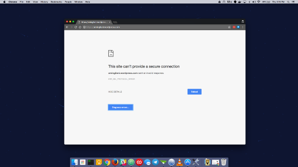
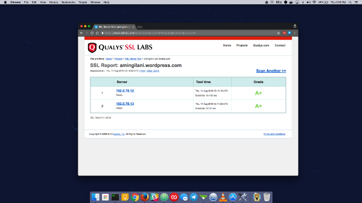
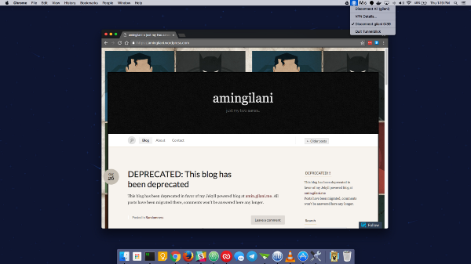

This is a live post as I continue my investigation, expect dead ends. I’ve testing with my old deprecated wordpress blog at amingilani.wordpress.com



A few days ago I opened a blog on wordpress and was met by an ERR\_SSL\_PROTOCOL\_ERROR error. Today, I tried that blog and met the same error on a different device. After a few tests, I realized all \*.wordpress.com sites gave me that very same error.



A quick test on the certificate tells me that everything should be working fine.



Like any normal person, I fired up my homemade VPN with a server just across the border in India, and found that the site was very much accessable

Let’s run a traceroute:

Pakistan:

```
$ # PAKISTAN
$ traceroute amingilani.wordpress.com
traceroute: Warning: amingilani.wordpress.com has multiple addresses; using 192.0.78.12
traceroute to lb.wordpress.com (192.0.78.12), 64 hops max, 52 byte packets
 1 10.1.1.1 (10.1.1.1) 42.541 ms 0.990 ms 0.947 ms
 2 192.168.1.1 (192.168.1.1) 2.106 ms 2.751 ms 2.640 ms
 3 * 39.63.32.1 (39.63.32.1) 60.465 ms 73.445 ms
 4 182.176.139.233 (182.176.139.233) 52.693 ms 56.122 ms 54.403 ms
 5 10.0.3.89 (10.0.3.89) 54.169 ms 57.881 ms 60.683 ms
 6 10.2.1.10 (10.2.1.10) 77.383 ms 74.301 ms 76.977 ms
 7 static-10ge-khi494-p01-khi494-swb.pie.net.pk (202.125.128.157) 74.406 ms
 static-10ge-khi275-p01-swa.pie.net.pk (202.125.128.173) 78.687 ms 78.526 ms
 8 static.khi77.pie.net.pk (202.125.128.171) 83.775 ms 82.016 ms 79.787 ms
 9 pos0–2–5–0.palermo17.pal.seabone.net (195.22.198.204) 182.421 ms 189.882 ms 184.768 ms
10 ae21.milano51.mil.seabone.net (195.22.205.39) 203.300 ms 202.661 ms
 ae19.milano51.mil.seabone.net (195.22.192.7) 206.100 ms
11 ntt-verio.milano51.mil.seabone.net (93.186.128.157) 240.907 ms 274.592 ms 228.377 ms
12 ae-6.r24.amstnl02.nl.bb.gin.ntt.net (129.250.2.50) 286.329 ms 250.129 ms 220.816 ms
13 ae-1.r02.amstnl02.nl.bb.gin.ntt.net (129.250.2.113) 289.403 ms 262.823 ms 264.765 ms
14 212.119.24.190 (212.119.24.190) 417.623 ms 357.530 ms 369.484 ms
15 192.0.78.12 (192.0.78.12) 368.945 ms 361.097 ms 459.545 ms

$ # INDIA
$ traceroute amingilani.wordpress.com
traceroute: Warning: amingilani.wordpress.com has multiple addresses; using 192.0.78.12
traceroute to lb.wordpress.com (192.0.78.12), 64 hops max, 52 byte packets
 1  10.8.0.1 (10.8.0.1)  522.272 ms  489.629 ms  488.288 ms
 2  139.59.0.253 (139.59.0.253)  491.051 ms
    139.59.0.254 (139.59.0.254)  492.159 ms
    139.59.0.253 (139.59.0.253)  493.209 ms
 3  138.197.249.22 (138.197.249.22)  492.963 ms
    138.197.249.16 (138.197.249.16)  487.629 ms
    138.197.249.22 (138.197.249.22)  511.884 ms
 4  202.56.198.57 (202.56.198.57)  489.229 ms  567.317 ms
    202.56.198.29 (202.56.198.29)  515.976 ms
 5  61.95.191.5 (61.95.191.5)  722.243 ms
    182.79.255.14 (182.79.255.14)  738.862 ms
    aes-static-118.36.144.59.airtel.in (59.144.36.118)  899.321 ms
...
```

Let’s fetch the cert through openssl:

```
$ # Pakistan
$ openssl s_client -showcerts -connect amingilani.wordpress.com:443
CONNECTED(00000003)
22396:error:140770FC:SSL routines:SSL23_GET_SERVER_HELLO:unknown protocol:/BuildRoot/Library/Caches/com.apple.xbs/Sources/OpenSSL098/OpenSSL098–59.60.1/src/ssl/s23_clnt.c:618:

$ # INDIA
$ openssl s_client -showcerts -connect amingilani.wordpress.com:443
CONNECTED(00000003)
depth=2 /C=US/ST=Arizona/L=Scottsdale/O=GoDaddy.com, Inc./CN=Go Daddy Root Certificate Authority — G2
verify error:num=20:unable to get local issuer certificate
verify return:0
 — -
Certificate chain
 0 s:/OU=Domain Control Validated/CN=*.wordpress.com
 i:/C=US/ST=Arizona/L=Scottsdale/O=GoDaddy.com, Inc./OU=http://certs.godaddy.com/repository//CN=Go Daddy Secure Certificate Authority — G2
 — — -BEGIN CERTIFICATE — — -
MIIFKDCCBBCgAwIBAgIIAfu9ABctn2QwDQYJKoZIhvcNAQELBQAwgbQxCzAJBgNV
BAYTAlVTMRAwDgYDVQQIEwdBcml6b25hMRMwEQYDVQQHEwpTY290dHNkYWxlMRow
GAYDVQQKExFHb0RhZGR5LmNvbSwgSW5jLjEtMCsGA1UECxMkaHR0cDovL2NlcnRz
LmdvZGFkZHkuY29tL3JlcG9zaXRvcnkvMTMwMQYDVQQDEypHbyBEYWRkeSBTZWN1
cmUgQ2VydGlmaWNhdGUgQXV0aG9yaXR5IC0gRzIwHhcNMTUwOTA2MTY1MjQxWhcN
MTgxMDE0MTEyOTI2WjA9MSEwHwYDVQQLExhEb21haW4gQ29udHJvbCBWYWxpZGF0
ZWQxGDAWBgNVBAMMDyoud29yZHByZXNzLmNvbTCCASIwDQYJKoZIhvcNAQEBBQAD
ggEPADCCAQoCggEBAMOLqLElQImwQFKMq3Uo/3Yk9SuVeuVYkDVTZpB58PiZCe6q
2f8kaITmhQoFfFMv444Wq0K9k72aHK1YhqEpU7cNvEZxfTrW+ubuUr53iZkfYS7j
ORHYdkGuKBZpysLJ8/k+Dm4TuOQwGNzEKaluAuWdWd2XmIEheD2kzlYey7JzvqXh
p6wmjCVhKD966AKBNcoL8WOtMdVPIRmR1I2FIN1dFTG4vKe4YPm7SiRNQ+keMuBf
Hb8l/Z3HHdGOroZnfR6dJWdmt8Z8JonAgA2BUOGCB9sB6BhJvMaBXQf2rBicRO+N
E6QOeEYeswSOEqPcVR9VSxhgq0HIHNXogg6O2vkCAwEAAaOCAbIwggGuMAwGA1Ud
EwEB/wQCMAAwHQYDVR0lBBYwFAYIKwYBBQUHAwEGCCsGAQUFBwMCMA4GA1UdDwEB
/wQEAwIFoDA3BgNVHR8EMDAuMCygKqAohiZodHRwOi8vY3JsLmdvZGFkZHkuY29t
L2dkaWcyczEtMTE5LmNybDBTBgNVHSAETDBKMEgGC2CGSAGG/W0BBxcBMDkwNwYI
KwYBBQUHAgEWK2h0dHA6Ly9jZXJ0aWZpY2F0ZXMuZ29kYWRkeS5jb20vcmVwb3Np
dG9yeS8wdgYIKwYBBQUHAQEEajBoMCQGCCsGAQUFBzABhhhodHRwOi8vb2NzcC5n
b2RhZGR5LmNvbS8wQAYIKwYBBQUHMAKGNGh0dHA6Ly9jZXJ0aWZpY2F0ZXMuZ29k
YWRkeS5jb20vcmVwb3NpdG9yeS9nZGlnMi5jcnQwHwYDVR0jBBgwFoAUQMK9J47M
NIMwojPX+2yz8LQsgM4wKQYDVR0RBCIwIIIPKi53b3JkcHJlc3MuY29tgg13b3Jk
cHJlc3MuY29tMB0GA1UdDgQWBBSjIIf50CVTMgx09Zz+DTIugaYCvjANBgkqhkiG
9w0BAQsFAAOCAQEAs+oqXpiA63H/EpGLtE+DusOazwvz1QzNsFRCqJSjflsV1Bc1
7zPwvNbxT4m96wbYEdCXvQi85MIGZ4+EJAz21gk9HCIsHGgr2farx1pp38flHZtH
wGnMenBscZJQfn1f1X4U5MsQMuSBMiO1zEF3Hf8kia2n3Dj4Dz80w8UTgnDpU3OL
6PYnca78Z/EC1slR1xZjYXBcTLIxkQNOlkvjW/7mlN6hDSVdmoNbw4ID8cy20Mtu
10BzTpB2TsvZwMGompxxpZE5vn5zc6WJHWajOAWbztCupAu2JfBNG1q67gvhBZPs
uGfPVF0ag8twse+vDwRwK5K51To6fR5LtJx5fw==
 — — -END CERTIFICATE — — -
 1 s:/C=US/ST=Arizona/L=Scottsdale/O=GoDaddy.com, Inc./OU=http://certs.godaddy.com/repository//CN=Go Daddy Secure Certificate Authority — G2
 i:/C=US/ST=Arizona/L=Scottsdale/O=GoDaddy.com, Inc./CN=Go Daddy Root Certificate Authority — G2
 — — -BEGIN CERTIFICATE — — -
MIIE0DCCA7igAwIBAgIBBzANBgkqhkiG9w0BAQsFADCBgzELMAkGA1UEBhMCVVMx
EDAOBgNVBAgTB0FyaXpvbmExEzARBgNVBAcTClNjb3R0c2RhbGUxGjAYBgNVBAoT
EUdvRGFkZHkuY29tLCBJbmMuMTEwLwYDVQQDEyhHbyBEYWRkeSBSb290IENlcnRp
ZmljYXRlIEF1dGhvcml0eSAtIEcyMB4XDTExMDUwMzA3MDAwMFoXDTMxMDUwMzA3
MDAwMFowgbQxCzAJBgNVBAYTAlVTMRAwDgYDVQQIEwdBcml6b25hMRMwEQYDVQQH
EwpTY290dHNkYWxlMRowGAYDVQQKExFHb0RhZGR5LmNvbSwgSW5jLjEtMCsGA1UE
CxMkaHR0cDovL2NlcnRzLmdvZGFkZHkuY29tL3JlcG9zaXRvcnkvMTMwMQYDVQQD
EypHbyBEYWRkeSBTZWN1cmUgQ2VydGlmaWNhdGUgQXV0aG9yaXR5IC0gRzIwggEi
MA0GCSqGSIb3DQEBAQUAA4IBDwAwggEKAoIBAQC54MsQ1K92vdSTYuswZLiBCGzD
BNliF44v/z5lz4/OYuY8UhzaFkVLVat4a2ODYpDOD2lsmcgaFItMzEUz6ojcnqOv
K/6AYZ15V8TPLvQ/MDxdR/yaFrzDN5ZBUY4RS1T4KL7QjL7wMDge87Am+GZHY23e
cSZHjzhHU9FGHbTj3ADqRay9vHHZqm8A29vNMDp5T19MR/gd71vCxJ1gO7GyQ5HY
pDNO6rPWJ0+tJYqlxvTV0KaudAVkV4i1RFXULSo6Pvi4vekyCgKUZMQWOlDxSq7n
eTOvDCAHf+jfBDnCaQJsY1L6d8EbyHSHyLmTGFBUNUtpTrw700kuH9zB0lL7AgMB
AAGjggEaMIIBFjAPBgNVHRMBAf8EBTADAQH/MA4GA1UdDwEB/wQEAwIBBjAdBgNV
HQ4EFgQUQMK9J47MNIMwojPX+2yz8LQsgM4wHwYDVR0jBBgwFoAUOpqFBxBnKLbv
9r0FQW4gwZTaD94wNAYIKwYBBQUHAQEEKDAmMCQGCCsGAQUFBzABhhhodHRwOi8v
b2NzcC5nb2RhZGR5LmNvbS8wNQYDVR0fBC4wLDAqoCigJoYkaHR0cDovL2NybC5n
b2RhZGR5LmNvbS9nZHJvb3QtZzIuY3JsMEYGA1UdIAQ/MD0wOwYEVR0gADAzMDEG
CCsGAQUFBwIBFiVodHRwczovL2NlcnRzLmdvZGFkZHkuY29tL3JlcG9zaXRvcnkv
MA0GCSqGSIb3DQEBCwUAA4IBAQAIfmyTEMg4uJapkEv/oV9PBO9sPpyIBslQj6Zz
91cxG7685C/b+LrTW+C05+Z5Yg4MotdqY3MxtfWoSKQ7CC2iXZDXtHwlTxFWMMS2
RJ17LJ3lXubvDGGqv+QqG+6EnriDfcFDzkSnE3ANkR/0yBOtg2DZ2HKocyQetawi
DsoXiWJYRBuriSUBAA/NxBti21G00w9RKpv0vHP8ds42pM3Z2Czqrpv1KrKQ0U11
GIo/ikGQI31bS/6kA1ibRrLDYGCD+H1QQc7CoZDDu+8CL9IVVO5EFdkKrqeKM+2x
LXY2JtwE65/3YR8V3Idv7kaWKK2hJn0KCacuBKONvPi8BDAB
 — — -END CERTIFICATE — — -
 2 s:/C=US/ST=Arizona/L=Scottsdale/O=GoDaddy.com, Inc./CN=Go Daddy Root Certificate Authority — G2
 i:/C=US/O=The Go Daddy Group, Inc./OU=Go Daddy Class 2 Certification Authority
 — — -BEGIN CERTIFICATE — — -
MIIEfTCCA2WgAwIBAgIDG+cVMA0GCSqGSIb3DQEBCwUAMGMxCzAJBgNVBAYTAlVT
MSEwHwYDVQQKExhUaGUgR28gRGFkZHkgR3JvdXAsIEluYy4xMTAvBgNVBAsTKEdv
IERhZGR5IENsYXNzIDIgQ2VydGlmaWNhdGlvbiBBdXRob3JpdHkwHhcNMTQwMTAx
MDcwMDAwWhcNMzEwNTMwMDcwMDAwWjCBgzELMAkGA1UEBhMCVVMxEDAOBgNVBAgT
B0FyaXpvbmExEzARBgNVBAcTClNjb3R0c2RhbGUxGjAYBgNVBAoTEUdvRGFkZHku
Y29tLCBJbmMuMTEwLwYDVQQDEyhHbyBEYWRkeSBSb290IENlcnRpZmljYXRlIEF1
dGhvcml0eSAtIEcyMIIBIjANBgkqhkiG9w0BAQEFAAOCAQ8AMIIBCgKCAQEAv3Fi
CPH6WTT3G8kYo/eASVjpIoMTpsUgQwE7hPHmhUmfJ+r2hBtOoLTbcJjHMgGxBT4H
Tu70+k8vWTAi56sZVmvigAf88xZ1gDlRe+X5NbZ0TqmNghPktj+pA4P6or6KFWp/
3gvDthkUBcrqw6gElDtGfDIN8wBmIsiNaW02jBEYt9OyHGC0OPoCjM7T3UYH3go+
6118yHz7sCtTpJJiaVElBWEaRIGMLKlDliPfrDqBmg4pxRyp6V0etp6eMAo5zvGI
gPtLXcwy7IViQyU0AlYnAZG0O3AqP26x6JyIAX2f1PnbU21gnb8s51iruF9G/M7E
GwM8CetJMVxpRrPgRwIDAQABo4IBFzCCARMwDwYDVR0TAQH/BAUwAwEB/zAOBgNV
HQ8BAf8EBAMCAQYwHQYDVR0OBBYEFDqahQcQZyi27/a9BUFuIMGU2g/eMB8GA1Ud
IwQYMBaAFNLEsNKR1EwRcbNhyz2h/t2oatTjMDQGCCsGAQUFBwEBBCgwJjAkBggr
BgEFBQcwAYYYaHR0cDovL29jc3AuZ29kYWRkeS5jb20vMDIGA1UdHwQrMCkwJ6Al
oCOGIWh0dHA6Ly9jcmwuZ29kYWRkeS5jb20vZ2Ryb290LmNybDBGBgNVHSAEPzA9
MDsGBFUdIAAwMzAxBggrBgEFBQcCARYlaHR0cHM6Ly9jZXJ0cy5nb2RhZGR5LmNv
bS9yZXBvc2l0b3J5LzANBgkqhkiG9w0BAQsFAAOCAQEAWQtTvZKGEacke+1bMc8d
H2xwxbhuvk679r6XUOEwf7ooXGKUwuN+M/f7QnaF25UcjCJYdQkMiGVnOQoWCcWg
OJekxSOTP7QYpgEGRJHjp2kntFolfzq3Ms3dhP8qOCkzpN1nsoX+oYggHFCJyNwq
9kIDN0zmiN/VryTyscPfzLXs4Jlet0lUIDyUGAzHHFIYSaRt4bNYC8nY7NmuHDKO
KHAN4v6mF56ED71XcLNa6R+ghlO773z/aQvgSMO3kwvIClTErF0UZzdsyqUvMQg3
qm5vjLyb4lddJIGvl5echK1srDdMZvNhkREg5L4wn3qkKQmw4TRfZHcYQFHfjDCm
rw==
 — — -END CERTIFICATE — — -
 — -
Server certificate
subject=/OU=Domain Control Validated/CN=*.wordpress.com
issuer=/C=US/ST=Arizona/L=Scottsdale/O=GoDaddy.com, Inc./OU=http://certs.godaddy.com/repository//CN=Go Daddy Secure Certificate Authority — G2
 — -
No client certificate CA names sent
 — -
SSL handshake has read 3888 bytes and written 456 bytes
 — -
New, TLSv1/SSLv3, Cipher is AES128-SHA
Server public key is 2048 bit
Secure Renegotiation IS supported
Compression: NONE
Expansion: NONE
SSL-Session:
 Protocol : TLSv1
 Cipher : AES128-SHA
 Session-ID: 5E2F4B82948C1C0D5BFF4FD20B2546A55D06A6DBBF57295FBAB1EE912C1B6AE2
 Session-ID-ctx:
 Master-Key: 112D8C7D5F3D28301F76321E27FD68342B6541BC2246629F7D6C99A9D14652867188EC9B95A809F3898E2DDE48BEA5D0
 Key-Arg : None
 Start Time: 1470905619
 Timeout : 300 (sec)
 Verify return code: 0 (ok)
 — -
closed
```
